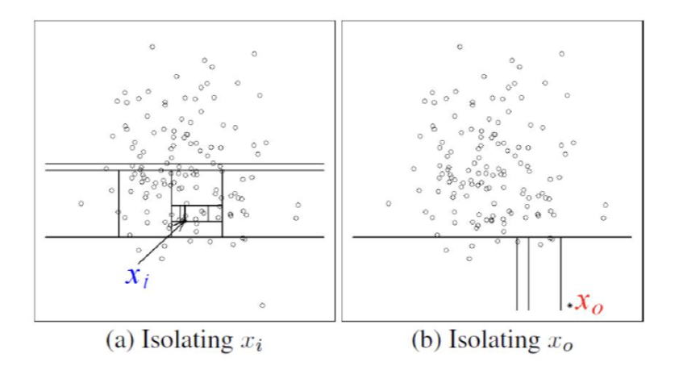
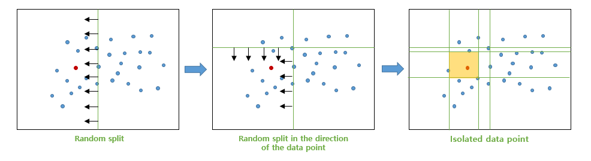
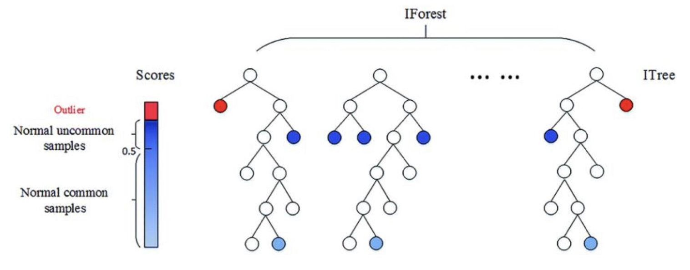

# ***Isolation Forest***

오늘은 Anomaly Detection의 한 방법인 Isolation Forest 알고리즘에 대해 설명해보려고 한다.

Forest는 이미 우리에게 익숙한 앙상블의 한 기법이다.

기존의 트리는 entropy나 gini impurity를 사용해 information gain 구해 트리를 분기하는 방식이지만 isolation forest는 조금 다른 트리 분기 방식을 사용하고 있다.

Isolation Forest는 알고리즘 이름 그대로 아주 **직관적인 방법이다.**

**각 데이터 포인트들이 몇번만에 데이터가 고립되는지에 따라 이상치를 판별**한다.

위의 그림을 보면 $x_i$는 비교적 normal 데이터이고 $x_o$는 abnormal 데이터로 보여진다.

그림에서처럼 $x_i$는 주변에 비슷한 데이터들이 많아 $x_i$데이터를 고립시키는데 많은 split이 필요하다.

하지만 $x_o$데이터는 단 몇번의 split으로 쉽게 $x_o$데이터를 고립시킬 수 있다.

 

### **그럼 어떤 방식으로 split을 진행할까?**

방식은 아주 간단하다.

기존의 의사결정나무는 information gain을 크게 가지는 변수와 기준점을 찾아 그 기준점으로 분할이 이루어진다.

isolation forest는 **임의의 변수**와 **임의의 기준점**으로 분할을 진행한다.

위의 그림에서 빨간색 데이터 포인트를 우리가 고립시키고자 하는 데이터라고 할때 랜덤한 특정 변수 값을 기준으로 분리를 한다.

첫번째 그림에서는 빨간색 데이터 포인트가 분할 왼쪽 면적에 위치하며 이제 우리는 오른쪽 면적을 신경쓸 필요가 없다.

두번째, 세번째 그림처럼 빨간색 데이터 포인트가 존재하는 방향으로 random split이 이루어지고 결국 빨간색 데이터 포인트를 고립시키게된다.

이러한 방식으로 전체 데이터에 대한 split을 진행하면 하나의 트리과정이 된다.

이 과정을 여러번 반복하여 **각 트리에서 구해진 각각의 데이터 포인트들의 split 횟수의 평균을 구하고 최종적으로 anomaly score를 계산**하게 된다.

### **Max depth 하이퍼파라미터**

하지만 모든 데이터 포인트의 split횟수를 구하는 것은 비효율적이다.

따라서 **max depth를 지정해 그 이상으로는 split을 진행하지 않도록 할 수 있다.**

최대 split 횟수에도 데이터가 고립되지 않는다면 해당 데이터는 그냥 정상으로 판단하는 것이다.

## ***Anomaly Score***

위의 그림과 같이 **데이터가 빨리 고립될 수록 높은 anomaly score를 가지게 된다.**

트리의 depth가 깊을 수록 낮은 score를 부여하여 정상데이터로 판별할 가능성을 크게 준다.

### **Anomaly score는 어떻게 계산될까?**

$$s(x,n) = 2^{\frac{-E(h(x))}{c(n)}}$$

$s(x,n)$는 Anomaly Score이다. 값의 범위가 0-1이기 때문에 보다 해석이 쉬울 수 있다. (그렇다고 기준 anomaly score가 있는 것은 아님)


- $X = \{x_1, x_2, \cdots , x_n\}$ , $x_i \in \mathbb{R}^d$ for all $i = 1, \cdots, N$
- $h(x)$ : path length of x (x의 split 횟수)
- $E(h(x))$ : average path length of x (각 iTree에서의 x split 횟수의 평균)
- $n$ : number of instances (dataset의 instance 수)


이때 $c(n)$은

(1) $c(n) = 2H(n-1) - (2(n-1)/n)$
(2) $H(i) = \ln(i) + 0.5772156649$

이 수식으로 정의가 가능하며 $h(x)$를 normalize하기 위해 사용되는 상수이며 전체 dataset의 평균경로 길이라고 볼 수 있다.

- $E(h(x)) \to c(n)$, $s \to 0.5$
   - x의 평균 split횟수와 모든 데이터의 평균 split횟수가 같다면 $s = 2^{-1} = 0.5$
- $E(h(x)) \to 0$, $s \to 1$
   - x의 평균 split횟수가 0번이라면 $s = 2^{0} = 1$
   - x의 평균 split횟수가 0번이라는 것은 거의 모든 iTree에서 가장 빠르게 고립되었다는 의미로 가장 큰 Anomaly Score를 가지게 됨
- $E(h(x)) \to n-1$, $s \to 0$
   - x의 평균 split횟수가 n-1번이라면 $s = 2^{-\infty} = 0$
   - x의 평균 split횟수가 n-1번이라는 것은 거의 모든 iTree에서 max split횟수를 가졌다는 의미로 가장 낮은 Anomaly Score를 가지게 됨

+ 내용 추가 예정

### ***Extennded Isolation Forest***

이 블로그는 고려대학교 김필성 교수님 강의를 바탕으로 작성되었습니다.
[강의 영상](https://www.youtube.com/watch?v=puVdwi5PjVA&list=PLetSlH8YjIfWMdw9AuLR5ybkVvGcoG2EW&index=20)  / [슬라이드](https://github.com/pilsung-kang/Business-Analytics-IME654-/blob/master/03%20Anomaly%20Detection/03-7_Anomaly%20Detection_Isolation%20Forest.pdf)
