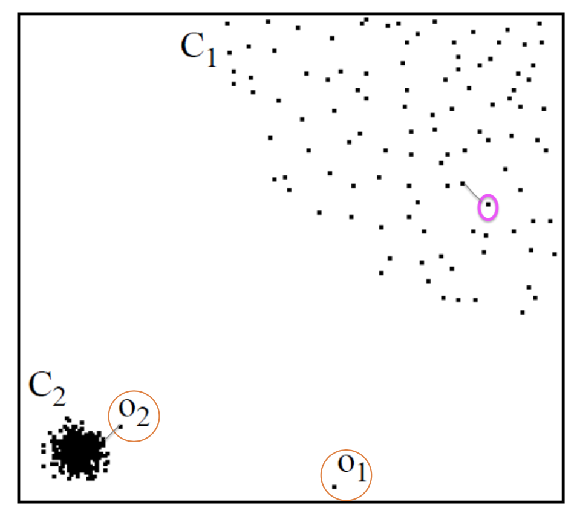
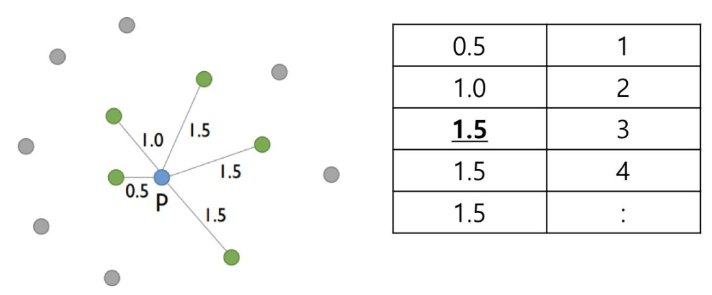
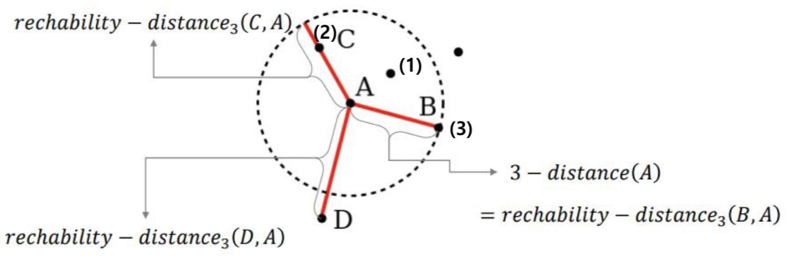
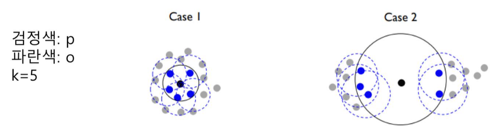
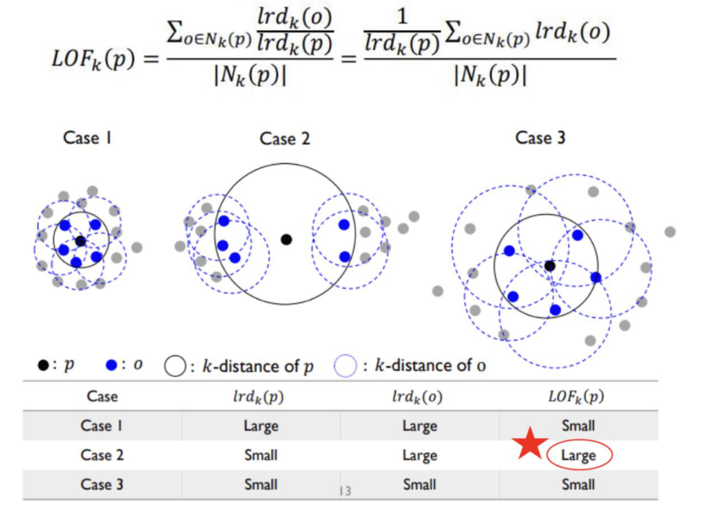

# ***Anomaly Detecton***

## ***Local Outlier Factor(LOF) Algorithm***

오늘은 밀도 기반의 Local Outlier Factor 알고리즘에 대한 설명을 해보려고한다.  
이 알고리즘의 핵심은 local density를 고려하는 것이다.  
밑에 그림으로 쉽게 예시를 들어보려고 한다.

O1, O2의 인스턴스가 있다.

O1의 인스턴스는 직관적으로도 확실하게 outlier로 보인다.

그렇다면 O2는 어떨까?

그림에서 핑크색으로 표시한 C1그룹간의 객체 사이의 거리와 O2와 C2그룹의 객체 사이의 거리가 크게 달라보이진 않는다.

하지만 C1그룹의 밀도는 낮고 C2그룹의 밀도는 높다.

**즉, 이웃 그룹의 밀도를 고려하여 객체의 이상치를 판별하고자 하는 것이 이 알고리즘의 의도라고 할 수 있다.**

---

## **Local Outlier Factor Process**

<mark>1. **k-distance(p) 정의하기** 
   
   p는 데이터의 한 포인트라고 볼 수 있다. 이때 k는 우리가 정의하는 파라미터이다.
   k=3이라고 정의했을때 3-distance(p)는 p에서 3번째로 가까운 거리를 가지는 또 다른 데이터 포인트 o와의 거리를 말한다.
   이때 p, o사이의 거리는 $d(p,o)$라고 표현할 수 있다.
   즉, k-distance는 $d(p,o)$로 정의한다.

   

   위의 그림으로 예시를 들어보도록 하겠다.
   위의 그림은 p에 인접한 포인트들과의 거리를 가까운 순으로 정렬해놓았다. 이때 k의 정의에 따라 k-distance는 이렇다.

   |  |
   | --- |
   | 2-distance(p) = 1.0 |
   | 3-distance(p) = 1.5 |
   | 4-distance(p) = 1.5 |

   이때 k는 두가지 조건을 만족해야 한다.
   1) $d(p,o') \leq d(p,o) $ 인 객체가 k개 이상이어야함
   2) $d(p,o') < d(p,o) $ 인 객체가 k-1개 이하여야함

   (여기서 o'은 p를 제외한 데이터 포인트를 말함)
   예를 들어 k=3이라고 가정할때, $d(p,o) = 1.5$ 이다.

   $d(p,o') \leq d(p,o) $는 5개이며 3보다 큰 수로 1번 조건을 만족한다. 
   $d(p,o') < d(p,o) $는 2개이며 3-1인 2개 이하로 2번 조건을 만족한다.
   
    

<mark> 2. **p와 근접한 객체 수 구하기**
   
   k-distance(p)가 정의됐다면 근접한 이웃 객체들을 찾을 수 있다.

   $N_k(p) = \{q \in D\)\ $\{p\} | d(p,q) \leq k-distance(p)\}$

   **p라는 객체의 k-distance neighorhood는 데이터셋에서 p를 제외한 q들의 집합 중 $d(p,q)$가 $k-distance(p)$의 거리보다 작거나 같은 객체의 수를 나타낸다.**

   

   위에서 사용한 이미지로 다시 예시를 들어보도록 하겠다.
   k=3이라고 할 때, 3-distance(p) = 1.5이며 1.5보다 작거나 같은 거리의 객체는 5개가 있으며 $N_3(p) = 5$라고 정의할 수 있다.

    

<mark> 3. **reachability distance 정의하기**
   
   앞서 k-distance(p)와 p의 이웃 객체들의 집합에 대한 정의를 내렸다. 그렇다면 이제 p와 p를 제외한 데이터들간의 도달가능한 거리(reachability distance)에 대해 알아보자.

   $reachability-distance_k(p,o) = max\{k-distance(o), d(p,o)\}$

   

   $reachability-distance(p,o)$를 구할 때 $k-distance(o)$와 $d(p,o)$의 거리 중 더 큰 값을 reachability distance값으로 정의할 수 있다.  

   이때 주의해야할 점은 $k-distance(p)$가 아니라 $k-distance(o)$를 구하는 것이다. 
   위의 이미지를 보시면 C의 도달가능한 거리는 $reachability-distance_k(C,A)$로 정의되며  
   이때 우리가 알아야 할 값은 $k-distance(A)$와 $d(C,A)$이다.  

   k=3이라고 할때 $3-distance(A)$는 $d(C,A)$보다 크고 그럼 이때 C의 reachability distance는 $d(C,A)$인 실제거리가 아니라 $3-distance(A)$가 된다.
   
    

<mark>4. **local reachability distance 정의하기**
   
   이제 reachability distance에 대한 정의가 끝났다면 local reachability distance에 대해 알아보도록 하겠다.

   $lrd_k(p) = \frac{|N_k(p)|}{\Sigma_{o \in N_k(p)}reachability-distance_k(p,o)}$

   **p객체에 이웃한 데이터 포인트 집합의 각 reachability distance의 합이 분모가되며 p객체의 이웃한 데이터 포인트의 수가 분자가 된다.**  

   앞서 설명한 예시들로 이어서 예를 들면 k=3이라고 할 때 2번 정의에 의해 $N_3(p) = 5$가 되고 $\Sigma_{o \in N_k(p)}reachability-distance_k(p,o) = 7.5$가 될 것이다.

   하지만 이 $lrd_k(p)$ 수식의 의도는 이렇다.

   

   Case1의  $lrd_k(p)$값보다 Case2의  $lrd_k(p)$값이 더 작기를 바라는 것이다.
   두케이스 다 $N_k(p) = 5$로 분자는 같지만 Case2의 reachability distance가 크기 때문에 Case2  $lrd_k(p)$의 분모가 Case1  $lrd_k(p)$의 분모보다 크므로 Case2의  $lrd_k(p)$값이 더 작아지게 된다.

    

<mark> 5. **local outlier factor 정의하기**

   이제 드디어 우리가 원하고자 하는 local outlier factor를 정의해보도록 하겠다.

   

   $LOF_k(p)$의 수식은 우리가 앞서 위에 정의한 모든 수식을 포함하고 있다.

   이미지 밑에 표를 보면 쉽게 이해하실 수 있을 것 같다.  
   명시된 값은 없으니 그냥 직관적으로 눈에 보이는 거리를 기준으로 이미지를 설명해보겠다.  
   먼저 분모인 $N_k(p)$는 모두 같다.  
   4번에서 정의했던 것 처럼 Case1의  $lrd_k(p)$는 Case2와 Case3보단 크다.  
   그렇다면  $lrd_k(o)$를 확인해보자.  
   p객체의 이웃집합 o들의 각각  $lrd_k(o)$의 총합을 구해야 한다.  
   이웃 데이터 포인트 o를 기준으로 보면 Case1과 Case2의 $lrd_k(o)$의 총합은 비슷해보인다.  
   Case3의 $lrd_k(o)$ 총합은 Case1과 Case2보다 작아보인다.

   그럼 이제 $LOF_k(p)$의 상대적인 스코어를 알 수 있다.  
   이미지의 표를 보면 Case2의  $LOF_k(p)$ 값이 Case1과 Case3보다 큰 것을 알 수 있다.  
   이 알고리즘의 의도였던 **이웃 그룹의 밀도를 고려하여 객체의 이상치를 판별**이 잘 이루어진 것 같다.

---

Local Outlier Factor 알고리즘에 대해 천천히 알아보았다.  
이 알고리즘은 수식이 복잡하지 않아 간략하게 설명을 해보았다.  
마지막으로 이 LOF Score에는 절댓값의 의미를 가지고 있지 않아 우리가 임곗값을 설정하여 어느정도값 이상을 이상치로  판별해야할지를 정해야 한다.   
데이터셋마다 Score의 분포가 다르고 특정값에 의미를 두기 어렵기 때문에 임곗값을 설정하는 것이 이 알고리즘의 과제라고 볼 수 있을 것 같다.

---