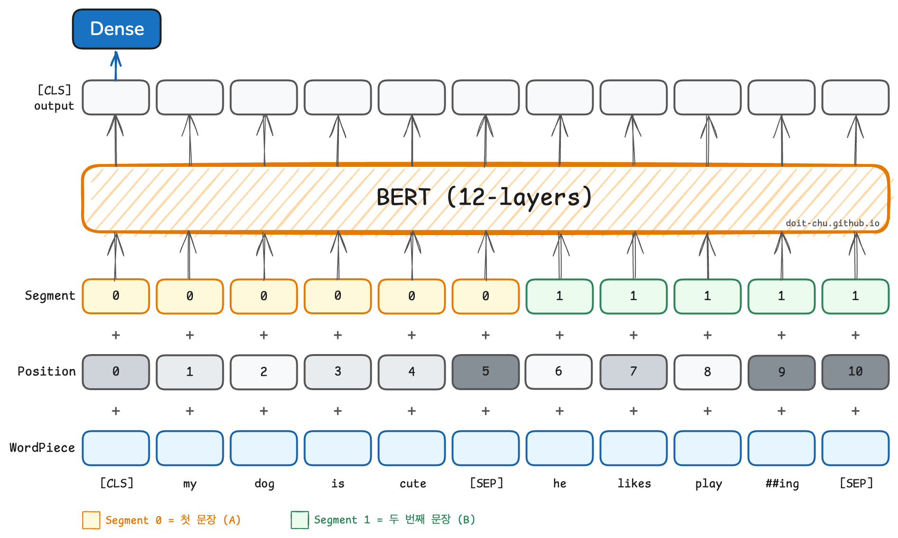
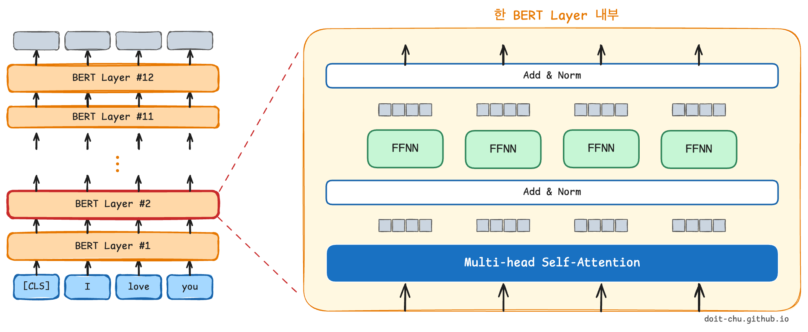
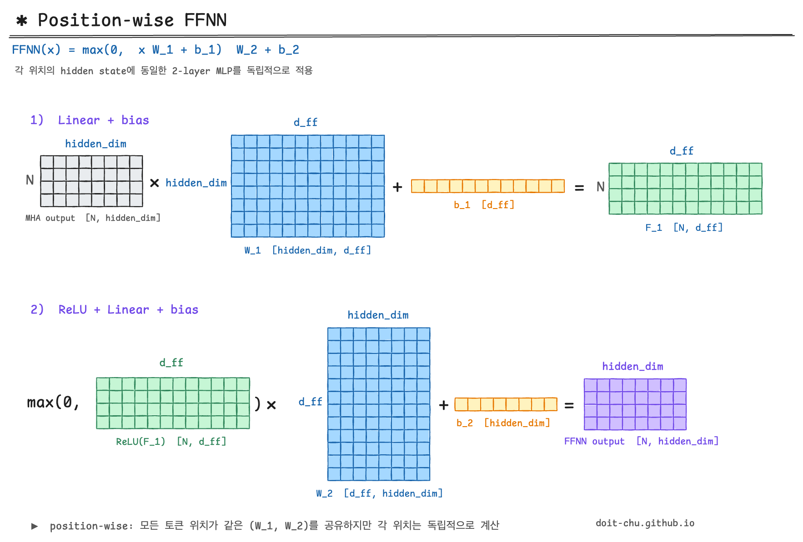

# **BERT**

BERT는 2018년 구글이 공개한 사전 훈련 모델이다.

<mark>**Transformer의 encoder 구조**</mark>를 사용해 구현되었으며 약 33억 개의 텍스트 데이터로 사전 훈련되었다.

이전의 Embedding 방식에서는 다의어나 동음이의어를 구분하지 못하는 문제점이 있었고 이러한 문제의 해결책으로 BERT가 출현하게 되었다.

그럼 어떠한 방식으로 BERT가 문장의 문맥을 이해하고 단어를 표현할 수 있는지 알아보자.

---

# **INPUT**

## **Wordpiece Tokenizer**

BERT에서는 subword tokenizer로 wordpiece tokenizer를 사용했다.

이는 자주 등장하는 단어 집합은 그대로 사용하고, 자주 등장하지 않는 단어의 경우, 더 작은 단위인 서브 워드로 분리하여 단어 집합에 추가한다.

**실제로 세상의 모든 단어들에 index를 부여하여 학습할 수 없기 때문에 모델이 단어를 처리할 수 있는 범위를 구하는 것**이다.

**즉, 경우의 수를 줄여 토큰을 재사용하고 OOV 처리에 용이하다는 장점**이 있다.

BERT에서는 이러한 방식으로 33억 개의 단어를 약 3만 개의 vocabulary에 담았다.

## **Positional Embedding**

**단어의 위치 정보를 얻기 위해 각 단어의 임베딩 벡터에 위치 정보들을 더하여 모델의 입력으로 사용하는 임베딩 값이다.**

transformer의 내부 구조를 살펴보면 알겠지만 BERT는 문장 내 모든 토큰을 참조하는 구조로 단어 입력을 순차적으로 받지 않기 때문에 단어의 위치 정보를 따로 주어야 한다.

따라서 **positional embedding을 진행하면 동일한 단어라도 문장 내의 위치에 따라 다른 값을 가질 수 있다.**

## **Segment Embedding**

**두 개의 문장을 입력으로 받을때 문장을 구분하기 위한 임베딩 값으로 사용**된다.

위 그림에서처럼 입력으로 두 개의 문장이 들어갔을때 각 문장에 0, 1값을 주어 두개의 문장을 구분할 수 있게 해주는 벡터이다.

따라서 wordpiece가 수행된 토큰들의 단어 임베딩 값과 위치 임베딩, 세그먼트 임베딩 값이 합산되어 BERT의 입력으로 들어가게 된다.


**input\_embedding = word\_embedding + positional\_embedding + segment\_embedding**


---

# **Encoder**

이제 입력 데이터를 살펴봤으니 BERT의 내부구조에 대해서 알아볼 차례다.

앞서 말했듯이 BERT는 transformer encoder 구조를 사용해 구현되었다.

위의 그림을 보면 입력 데이터가 들어오면 n개의 encoder(BERT Layer #n)가 쌓여있고 순차적으로 학습이 진행된다.

이해를 좀 더 쉽게 하기 위해 **Encoder 구조는 BERT-Base 기준으로 설명**을 하려고 한다.


**BERT-Base**

| 기호 | 값 | 의미 |
|---|---|---|
| L | 12 | encoder 12개 |
| D | 768 | 768차원의 embedding vector |
| A | 12 | 12개의 self-attention |


BERT-Base는 위와 같이 설정되어있다.

그럼 지금 Encoder는 12개가 쌓여있으며 한 Encoder의 내부구조는 위 그림에서 오른쪽에 그려진 구조를 참고하면 된다.

Encoder층은 순서대로

1. Multi-head Self-Attention
2. Add & Norm
3. FFNN
4. Add & Norm

으로 이루어진다.

---

## **1. Multi-head Self-Attention**



그림에서처럼 입력 데이터가 들어오면 Multi-head Self-Attention 층을 지나게 된다.

Multi-head attention 층은 여러 개의 self-Attention이 병렬적으로 학습되어있는 구조로 되어있다.   
self-attention 과정을 num_head개만큼 병렬적으로 진행하여 각 self-attention에서 나온 N X head_dim matrix(=attention head)를 모두 이어 붙이면 최종적으로 N x hidden_dim matrix가 나온다.  
그리고 이 matrix는 multi-head self-attention의 최종 output이 된다. 

그럼 Multi-head attention에서의 Self-Attention 구조를 좀 더 상세하게 살펴보자.

## **2. Self-Attention**



self-attention의 학습과정을 도식화한 그림이다.

설명을 순서대로 진행하기 위해 파트별로 박스와 번호를 설정해놨다.

### **1)** 입력 X

먼저 input matrix를 보자. **그림에서의 matrix은 문장 하나가 input으로 들어갔을 경우를 행렬로 그린 것이다.**

**N은 우리가 설정한 최대 단어 길이**이며 BERT-Base에서는 최대 단어 길이를 512로 설정하였기 때문에 N은 512로 볼 수 있다.

**hidden_dim은 embedding 차원**을 나타내며 BERT-Base기준으로 768차원이라고 볼 수 있다.

따라서 현재 512x768차원의 행렬이 입력으로 들어간다.

### **2)** Q, K, V 계산 

여기서 우리는 **hidden_dim은 [hidden_dim, head_dim] 차원의 3개의 가중치 행렬과 각각 연산을 진행**한다.

이때 **head_dim은 D(embedding vector=768) / A(number of self-attention=12)로 설정이 되며** BERT-Base 기준으로 768/12=64차원이 된다.

이렇게 설정하는 이유는 우리가 학습이 끝난 각각의 self-attention의 output을 concat 하게 되는데 이때 차원이 기존의 embedding차원으로 나와야 하기 때문이다.

즉, 우리는 12개의 self-attention을 수행하고 각 self-attention에서 64차원의 행렬이 output으로 나오게 되면 이를 이어 붙여 12 \* 64 = 768차원의 최종적인 multi-head self-attention의 output을 구할 수 있게 된다.

**각 가중치 행렬을 연산하게 되면 우리는 hidden_dim x head_dim 차원의 Q(query), K(key), V(value) matrix를 얻게 되며**

<mark>**이 각각의 matrix는 값은 다 다르지만 본질적으로 input의 정보를 내포하고 있는 matrix이다.**</mark>

### **3)** Q * K^T = Score

이제 attention score를 구하는데 transformer에서 attention score method는 scaled dot method를 사용하였다.


scaled dot method = $Q \* K^T / \sqrt{d_k}$


**method를 따라서 Q matrix와 K의 역행렬 matrix 연산을 수행**한다.

이 연산은 각 token들이 문장 내의 모든 token과 연산을 하는 과정이다.

따라서 **우리가 얻어낸 N x N matrix은 각 토큰이 문장내의 모든 토큰을 참고한 값을 가지고 있는 행렬**이라고 볼 수 있다.

### **4)** Scaling & Softmax

**얻어진 N x N matrix에 scaling을 진행한 후 softmax를 씌운다.**

softmax를 적용한 N x N matrix는 각 feature vector의 합이 1인 어떠한 확률 값을 가지게 된다.

**이 확률 값의 의미는 각 토큰이 참고한 토큰들과의 유사도를 의미**한다.

### **5)** Output

**softmax를 수행한 NxN 유사도 행렬을 V matirx와 연산**해준다.

그럼 self-attention의 최종 output으로 N x head_dim의 matrix을 얻게 되며 이 matrix는 문장 내에 어떤 단어들이 유사한지를 알 수 있게 해 준다.

즉, self-attention을 통해 "그 **동물**은 길을 건너지 않았다. 왜냐하면 **그것**은 너무 피곤하였기 때문이다."라는 문장에서 '**그것**'이 '**동물**'과 연관성이 크다는 것을 기계가 학습하는 것이다.

---

## **3. Add & Norm**

### **3-1.Residual Connection**



multi-head self-attention층을 통과하면 Add & Norm층을 통과한다.

Add는 Residual Connection을 뜻한다.

multi-head self-attention을 통과한 output과 multi-head self-attention을 통과하기 전의 input 행렬은 동일한 차원을 가지고 있다.

**이 두 행렬을 다시 더해주는 것이 Residual Connection**이다.

Residual Connection은 computer vision의 ResNet이란 모델에서 나온 방법으로 multi-head self-attention을 통과한 output이 기존의 input 정보를 많이 손실하여 **기존 input 정보를 최대한 보존하고자 하는 것이 목적**이다.

### **3-2. Layer Normalization**

다음 Norm은 Layer Nomalization을 뜻한다.

Layer Normalization은 각 feature vector를 정규화한다. (Batch Normalization에서는 각 feature를 정규화)

정규화 방식은 두 가지이다.

**1) $\mu=0, \sigma^2=1$**

우리가 잘 알고 있는 정규화 방식이다. vector의 평균과 분산을 구해 정규화를 수행한다.


$\hat{x_i} = \dfrac{x_i - \mu}{\sqrt{\sigma^2}}$


정규화를 수행하는 이유는 **초기 입력이 정규분포더라도 hidden layer를 지나면서 분포가 점점 정규화를 벗어나 Gradient Vanishing 문제를 야기할 수 있기 때문에 이를 방지하고자 정규화를 수행**한다.

**2) $\gamma, \beta$**

1) 번 방식으로 정규화를 수행한 후 $\gamma$와 $\beta$를 사용한다.


$Norm(x_i) = \gamma\hat{x_i} + \beta$


$\gamma=1, \beta=0$의 초기화 값을 가지며 모두 학습 가능한 변수이다.

1) 번 방식으로 **계속해서 정규화를 수행하면 데이터가 비선형 성질을 잃게 되어 이를 방지하고자 2) 번 방식을 수행**한다.

---

## **4. Position-wise FFNN(Feed Forward Neural Network)**

두 번째 층인 Add&Norm을 통과하면 FFNN층을 통과하게 된다.

그림으로 표현하긴 했지만 더 **쉽게 설명하자면 Dense Layer를 두 개 쌓은 것**이다.

최종 Layer는 input과 output차원이 동일하도록 d\_model 수만큼의 unit을 설정한다.

---

## **5. Add & Norm**

2.Add & Norm과 같은 과정이므로 생략

---


이러한 아키텍처를 가진 BERT가 어떠한 방식으로 모델을 학습시켰는지도 해당 포스터에 같이 적으려고 했는데..

귀찮다.........

MLM 내용 5줄 적고 일주일째 미루고 있어서 일단 아키텍처 부분만 업로드하는 걸로...

