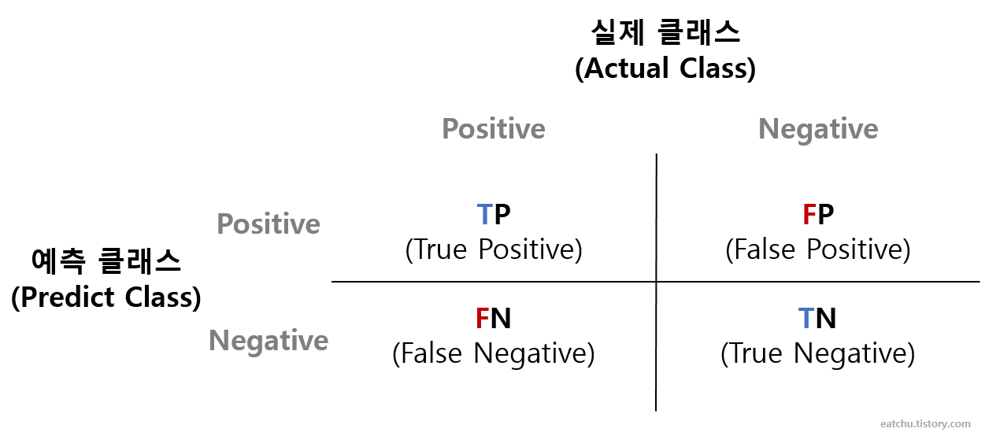
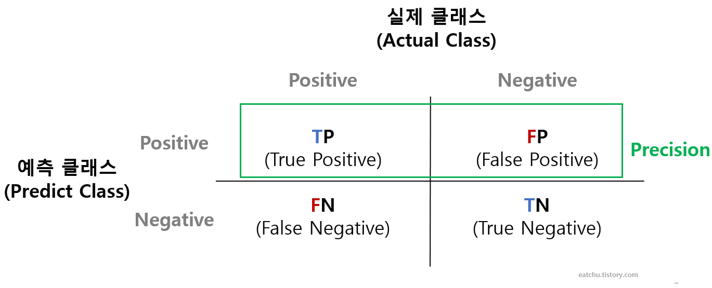
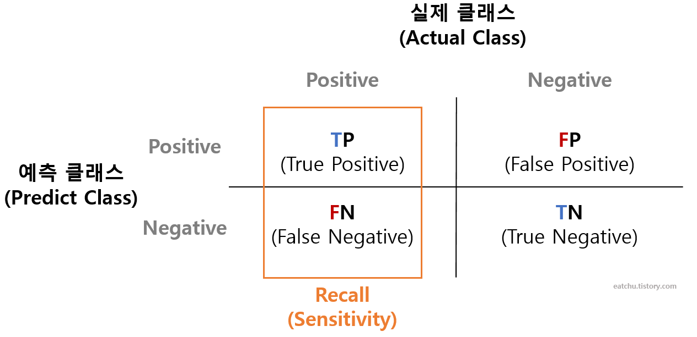
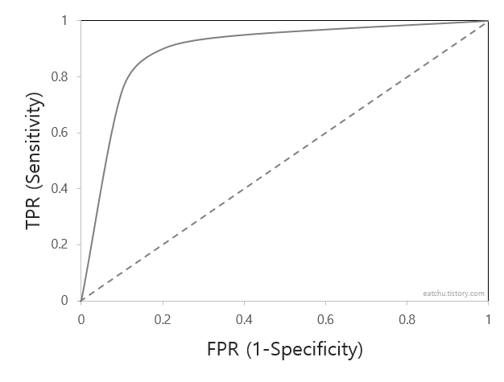
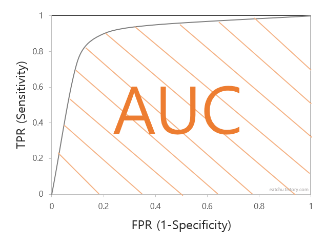

##  분류 성능 평가 지표
- 정확도(Accuracy)
- 오차행렬(Confusion Matrix)
- 정밀도(Precision)
- 재현율(Recall)
- F1-Score
- ROC-AUC

이 평가 지표들은 이진 분류와 다중 분류에 모두 적용될 수 있다.  
특히 이진 분류에서 더욱 강조되는 지표이다.  
이제 이 평가 지표들에 대해 좀 더 상세하게 내용을 적어보고자 한다.

 

### **정확도 Accuracy**

정확도는 직관적으로 모델 예측 성능을 나타내는 평가 지표이다.  
이진 분류일 경우 모델의 성능을 왜곡할 수 있기 때문에 정확도 수치 하나만 가지고 성능을 평가하긴 어렵다.  
불균형한 레이블 값 분포의 데이터에서는 모델의 성능이 실제로 좋지 못하더라도 정확도가 높을 수 있다.

    ex) 100개의 dataset에서 90개의 데이터 라벨이 0, 10개의 데이터 라벨이 1이라고 할 때 0만을 예측하는 모델의 정확도는 90%가 된다.

즉, 데이터 분포도가 균일하지 않은 경우 높은 수치가 나타날 수 있는 것이 정확도 평가 지표의 맹점이다.  
하지만 우리가 다루는 많은 데이터들은 불균형한 데이터로 이루어져 있다.  
이러한 한계점을 극복하기 위해 여러 가지 분류 지표와 함께 적용해야 하며 같이 고려하면 좋을 오차 행렬에 대해 설명해보도록 하겠다.

 

###  **오차 행렬 Confusion Matrix**
오차 행렬은 이진 분류에서 어떠한 유형의 예측 오류가 발생하고 있는지를 함께 나타내는 지표이다.

오차 행렬은 실제 라벨 값과 예측 라벨 값을 넣은 4분면으로 이루어져 있으며 이것들을 다양하게 결합해 분류 모델 예측 성능의 오류가 어떠한 모습으로 발생하는지 알아볼 수 있다.

<figure>
  
  <figcaption>오차행렬(Confusion Matrix) 그래프</figcaption>
</figure>

TP / TN / FP / FN을 헷갈리는 사람이 있을 것 같아 하나 덧붙이자면 앞 뒤 스펠링을 해석하여 구분하면 절대 헷갈릴 일이 없다.


- **TP** : Positive로 예측했고 True임  -> 예측값도 Positive, 실제값도 Positive  
- **TN** : Negative로 예측했고 True임  -> 예측값도 Negative, 실제값도 Negative  
- **FP** : Positive로 예측했고 False임 -> 예측값은 Positive이지만 틀렸으므로 실제값은 Negative  
- **FN** : Negative로 예측했고 False임 -> 예측값은 Negative이지만 틀렸으므로 실제값은 Positive


위의 오차행렬에 따라 정확도의 계산은 이렇게 할 수 있다.

    정확도(Accuracy) = (TN + TP) / (TN + FP + FN + TP)

앞서 정확도는 우리가 불균형한 데이터를 다룰 때 모델의 신뢰도를 떨어뜨릴 수 있다고 설명했다.  
따라서 오차행렬을 사용하여 불균형한 데이터에서 정확도보다 더 선호되는 정밀도와 재현율에 대해 알아보자.  
(재현율은 민감도라고도 불림)

 

### **정밀도 Precision**

<figure>
  
  <figcaption>정밀도(Precision)를 확인하는 지표</figcaption>
</figure>

모델이 Positive라고 예측한 것들 중 실제 Positive가 맞은 확률 -> TP / (TP + FP)  
정밀도를 높이려면 FP를 줄여야 하기 때문에 Negative를 Positive로 예측할 경우를 줄여야 함.

***정밀도가 중요 지표인 경우***

- 실제 음성 데이터를 양성으로 잘못 판단하게 되면 업무상 큰 영향이 발생하는 경우.
- 실제 스팸 메일(양성)을 일반 메일(음성)로 분류하게 되면 사용자가 불편함을 느끼겠지만 일반 메일을 스팸 메일로 분류할 경우 필요한 메일을 받지 못하는 업무상 차질이 생길 수 있다.

 

### **재현율 Recall , 민감도 Sensitivity**

실제 Positive 중 모델이 Positive라고 예측한 확률 -> TP / (TP + FN)  
재현율을 높이려면 FN을 줄여야 하기 때문에 Positive를 Negative로 예측할 경우를 줄여야 함.

***재현율이 중요 지표인 경우***

- 실제 양성 데이터를 음성 데이터로 잘못 판단하게 되면 업무상 큰 영향이 발생하는 경우.
- 암환자를 음성이 아닌 양성으로 잘못 판단했을 경우 오류의 대가는 재검사를 하는 수준의 비용이지만 양성인 환자를 음성으로 잘못 판단했을 경우 오류의 대가는 생명이다.

 

### **특이도 Specificity**

실제 Negative 중 모델이 Negative라고 예측한 확률 -> TN / (TN + FP)

<mark>***정밀도, 재현율 뭐가 더 중요할까? : 각 지표의 맹점***</mark>

정확도 100%의 분류 모델을 만들지 않는 한 정밀도와 재현율을 둘 다 끌어올리는 것은 한계가 있다.  
**정밀도를 끌어올리기 위해 높은 임계값을 설정해 확실한 Positive만 양성으로 예측하고 나머지를 다 Negative로 예측한다면 정밀도는 100%에 가깝게 나오겠지만 재현율은 낮을 것이다.**  
**반대로 재현율을 끌어올리기 위해 모든 값을 다 Positive로 예측한다면 재현율은 100%가 나올 것이고 정밀도는 낮을 것이다.**  
데이터와 해당 과제에 맞추어 정밀도와 재현율 중 상대적인 중요도를 부과할 순 있지만 그렇다고 하나의 지표에만 치중하는 것은 위험하다.

따라서 정밀도와 재현율의 수치가 적절하게 조합되어 사용될 수 있는 평가지표인 F1-Score에 대해 알아보겠다.

 

### **F1-Score**

정밀도와 재현율을 결합한 지표로 두 지표가 어느 한쪽도 치우치지 않는 수치를 나타낼 때 상대적으로 높은 값을 가진다.



위에는 F1-Meature의 수식이다. **Precision과 Recall에 동일한 가중치를 부여**한다. 
주로 F1-Meature를 흔히 사용하지만 β값에 따라 Precision이나 Recall에 더 많은 가중치를 부여할 수 있다.



각각 어떻게 가중치가 설정되는지를 수식으로 추가 설명하자면

$P = precision, \; R = Recall$  

$\alpha = \frac{1}{\beta^2+1}, \; (1-\alpha) = \frac{\beta^2}{\beta^2+1}$  

$F = \frac{1}{\alpha\frac{1}{P} + (1-\alpha)\frac{1}{R}}$  

$ \quad = \frac{PR}{\alpha R + (1-\alpha)P}$  

$ \quad = \frac{(1+\beta^2)PR}{\beta^2(P+R)}$

α값이 각 P와 R에 가중치를 부여하는 값이라고 생각하면 된다.

1) P와 R에 동일한 가중치를 부여하는 경우 (α = 0.5) -> β = 1

2) P에 더 많은 가중치를 부여하는 경우 (α = 0.8) -> β = 0.5

3) R에 더 많은 가중치를 부여하는 경우 (α = 0.2) -> β = 2

 

### **ROC-AUC**

ROC curve에 기반한 AUC score는 이진 분류의 예측 성능 측정에서 중요하게 사용되는 지표이다.

ROC curve는 원래 2차 대전 때 통신 장비 성능 평가를 위해 고안된 수치이며 일반적으로 의학 분야에서 많이 사용되지만, 머신러닝의 이진 분류 모델의 예측 성능을 판단하는 중요한 평가 지표이기도 하다.

ROC curve는 FPR(False Positive Rate)를 x축으로, TPR(True Positive Rate)를 y축으로 잡아 FPR의 변화에 따른 TPR의 변화가 곡선 형태로 나타나는 그래프이다.

여기서 **TPR은 앞서 설명한 재현율 지표이며 실제 Positive 중에 모델이 Positive로 잘 예측한 비율**을 말한다.

    TPR = TP / (TP + FN)

**FPR은 실제 Negative 중에 모델이 Negative로 예측하지 못한 비율**을 말한다. (다시 말해 실제 Negative 중에 모델이 Positive로 예측한 비율)

    FPR = FP / (TN + FP)

FPR은 앞서 설명한 특이도 지표와 관련해서도 설명이 가능하다.

    1 - 특이도 = 1 - (TN / (TN + FP)) = FP / (TN + FP)

즉, FPR =  1 - Specificity로도 볼 수 있다.

좋은 성능을 가진 모델이라면 FPR은 0에 가깝고 TPR은 1에 가까운 값을 가지는게 좋다.

ROC curve는 threshold를 조절하면서 TPR과 FPR 변화율을 구한다.

threshold를 1로 지정하면 예측값이 전부 Negative로 설정되어 FPR은 0이 된다. 이때 Positive 예측값이 없으므로 TPR 역시 0이다.

threshold를 0으로 지정하면 예측값이 전부 Positive로 설정되어 FPR은 1이 된다. 이때 예측값이 전부 Positive이므로 TPR 역시 1이다.

threshold가 커지면 기본적으로 TPR, FPR값이 모두 작아지는데 FPR보다 TPR이 더 천천히 작아진다면 좋은 성능의 모델이라고 할 수 있다.

AUC는 ROC curve의 아랫부분 면적이다.
ROC curve에 대해 잘 이해했다면 AUC값이 클수록(1에 가까울수록) 성능이 좋다는 것을 알 수 있을 것이다.


0.9 - 1 : EXCELLENT  
0.8 - 0.9 : GOOD  
0.7 - 0.8 : FAIR  
0.6 - 0.7 : POOR  
0.5 - 0.6 : FAIL

