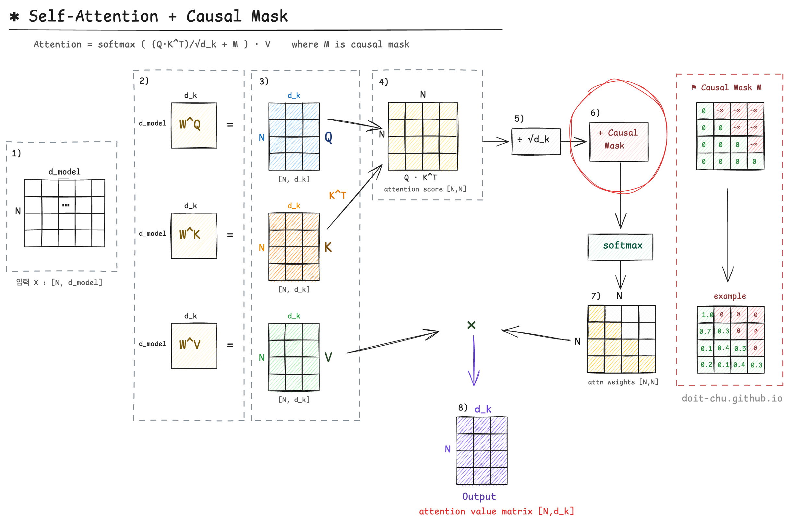
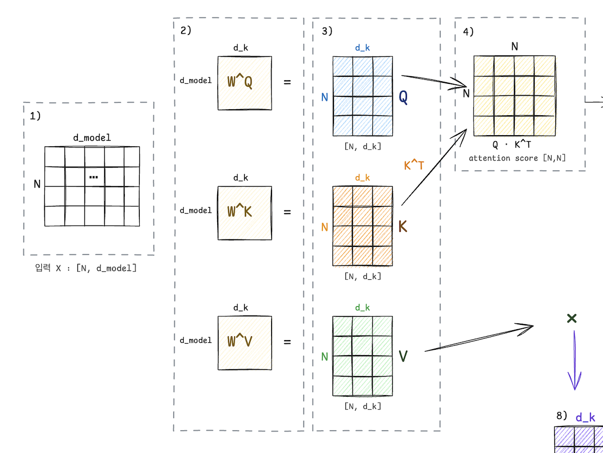
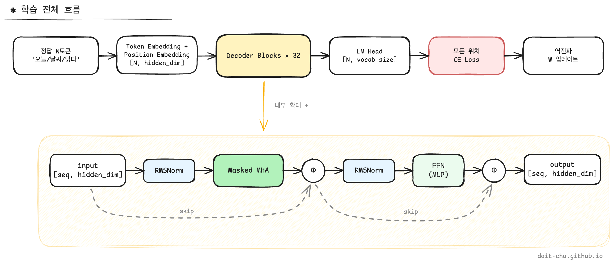
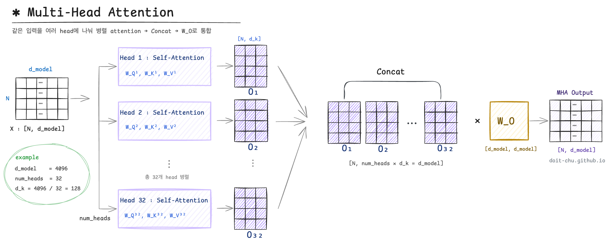

BERT까지 공부했는데 막상 GPT 계열 LLM을 들여다보면 갑자기 생소한 단어들이 쏟아진다. <br>
그래서 최근에 여유시간을 최대한 활용해서 관련 주요 구조, 기술 등에 대해 쭉 훑어봤다. <br>
공부해보니 BERT 또는 transformer 구조를 잘 숙지하고 있으면 이 생소한 단어들이 그렇게 어렵진 않더라.. 

어쨌든 이 글에서는 그 출발점을 정리해보려고 한다.
대충 쭉 보긴했는데 이렇게 안적어두면 매번 까먹어서 일단 글을 적어보면서 다시 제대로 구조를 이해해보려고 한다. 

---

## BERT와 GPT

BERT와 GPT는 **2017년 Transformer라는 공통 부모에서 갈라진 형제**라고 볼 수 있다. 

심지어 순서로만 보면 **GPT가 먼저 나왔다.** (GPT 2016년 6월, BERT는 10월임)  <br>
사실 예전엔 분류든 임베딩이든 결국 BERT base 위에 task head를 올리는 구조가 베스트라고 여겨졌고, 그 패턴만 알아도 많은 task들을 처리할 수 있었다. 개인적으로 난 GPT 계열은 API로 텍스트를 생성해주는 모델 정도로만 인식했지, 직접 뜯어보거나 다뤄볼 일이 없었다. 

그러다 chatGPT가 등장하고, 다음 해부터 여러 오픈소스들이 줄줄이 풀리면서 분위기가 완전히 바뀌었던것 같다. <br>
처음엔 "BERT 위에 뭔가를 올리면 GPT 아닌가?"라는 막연한 이미지를 갖고 있었는데 실제로는 self-attention 가중치 자체가 **양뱡향이냐 단방향이냐** 가정으로 처음부터 다르게 학습되는 구조라고 볼 수 있겠다.  

또 하나 헷갈리는 게 이름이다. "Decoder-only"라는 표현 때문에 원조 Transformer의 Decoder 블록을 그대로 떼어다 쓴 것처럼 들리는데, 사실은 그렇지 않더라.

| 블록 | 구성 |
|---|---|
| 원조 Transformer Decoder | Masked Self-Attention + **Cross-Attention** + FFN |
| GPT 블록 | Masked Self-Attention + FFN |

원조 Decoder에 있던 Cross-Attention(인코더와 연결되는 부분)은 **제거**됐다. <br>
즉 구조만 놓고 보면 GPT 블록은 **BERT 블록에 <mark>causal mask</mark> 하나만 추가한 형태**에 가까워 보인다. <br>
다만 이 mask 한 줄이 단순히 구조에만 영향을 주는 게 아니다. 뒤에서 보겠지만 <mark>**학습 방식도 달라진다.**</mark>

---

## Causal Mask란?

그럼 mask가 들어가면 뭐가 달라질까? <br>
같은 4개 토큰("I love my dog")을 봤을 때 BERT와 GPT의 attention 패턴은 이렇다.

```text
BERT (bidirectional):           GPT (causal):

       I  love  my  dog              I  love  my  dog
   I   ✓   ✓   ✓   ✓             I   ✓   ·   ·   ·
love   ✓   ✓   ✓   ✓          love   ✓   ✓   ·   ·
  my   ✓   ✓   ✓   ✓            my   ✓   ✓   ✓   ·
 dog   ✓   ✓   ✓   ✓           dog   ✓   ✓   ✓   ✓
```

- **BERT** : 모든 토큰이 모든 토큰을 본다. "my"가 "dog"를 봐도 됨.
- **GPT** : 각 토큰은 **자기 자신 + 왼쪽 토큰만** 본다. "my"는 "dog"를 못 봄.

오른쪽 위 삼각형을 막아두는 이 한 줄짜리 마스크가 사실상 모든 걸 바꿔놓는다.

1. **학습 목표가 달라진다.** : BERT는 빈칸 채우기(MLM), GPT는 다음 토큰 예측.
2. **사용 방식이 달라진다.** : BERT는 "이해", GPT는 "생성".
3. **각 토큰이 가진 정보가 달라진다.** : BERT의 토큰 표현은 전체 문맥, GPT의 토큰 표현은 자기까지의 문맥.


---

## 학습 방식의 차이

mask가 양방향이냐 단방향이냐를 가른다고 했는데, 결국 이 차이가 **학습 목표 자체를 다르게 만든다.**

### BERT — 빈칸 채우기 (MLM)

입력 토큰 중 일부를 `[MASK]`로 가린 뒤, 그 자리를 **양쪽 문맥을 다 보고** 맞춘다.

```text
입력 : I love my [MASK]
정답 : dog
```

양방향이라 가능한 학습법. 한 마디로 **"현재 위치의 가려진 토큰 맞히기."**

### GPT — 다음 토큰 예측 (CLM)

정답 문장을 한 칸씩 밀어서 입력·정답 쌍을 만든다.
각 위치에서 **자기까지의 토큰만 보고 다음 토큰을 예측**한다.

```text
입력 : I love my
정답 : love my dog
```

단방향이라 가능한 학습법. 한 마디로 **"다음 위치 토큰 맞히기."**

같은 self-attention 위에 mask 한 줄이 학습 패러다임 자체를 바꿔놓는 셈이다. <br>
그럼 이 mask가 self-attention 안의 어느 지점에 끼어드는지 들어가 보자.

---

## Self-attention

causal mask는 어디에 적용될까.


**Causal mask 적용 위치 : $Q \times K^T$ 계산 직후, softmax 직전.**


일단 난 모델 구조도를 그리면서 이해하는걸 굉장히 좋아하기 때문에, 이미지를 같이 보면 좋을 것 같다.




1\) input matrix <br>
2\) Q,K,V 가중치 matrix <br>
3\) 1)과 2)를 연산하여 Q, K, V matrix 생성 <br>
4\) Q × K^T → nxn의 attention score matrix 생성 <br>
5\) √d_k 로 scaling <br>
 <br>
7\) Softmax(-∞ 위치는 0이 됨) 
8\) weight × V → 최종 출력



**① 왜 $Q \times K^T$ 직후인가**

$Q, K, V$ 자체는 그냥 각 토큰의 표현 벡터일 뿐, 토큰 사이의 "관계"는 아직 등장하지 않는다. 토큰 $i$ 가 토큰 $j$ 를 본다는 의미가 **처음 등장하는 게 attention score 행렬 $Q K^T$** 다. 그러니까 "토큰 간 시야 제한"을 거는 mask는 이 행렬 위에서 적용되어야 한다.

**② 왜 softmax 직전인가**

softmax 이후에 0으로 만들면 어떻게 될까? 각 행의 weight 합이 1이 안 된다. 확률 분포가 깨진다. 그래서 **softmax 직전에 -∞로 만들어버린다.** $e^{-\infty} = 0$ 이라서 softmax를 거치면 해당 위치는 자연스럽게 0이 되고, 나머지 칸들이 자동으로 재정규화되어 합이 1 유지된다.

이미지에도 나와있지만 예시를 보면 더 명확하다.

```text
attention score (Q × K^T / √d_k):
         I    love   my    dog
   I    2.1   0.3   1.2   0.5
 love   0.8   3.4   1.1   0.9
   my   1.0   1.5   2.8   0.6
  dog   0.4   0.7   1.3   3.1

           ↓ causal mask ↓

         I    love   my    dog
   I    2.1   -∞    -∞    -∞
 love   0.8   3.4   -∞    -∞
   my   1.0   1.5   2.8   -∞
  dog   0.4   0.7   1.3   3.1

           ↓ softmax (행 단위) ↓

         I    love    my    dog
   I    1.00  0.00   0.00  0.00
 love   0.07  0.93   0.00  0.00
   my   0.10  0.18   0.72  0.00
  dog   0.04  0.06   0.13  0.77
```

구현상으론 한 줄이다.

```python
attention_scores.masked_fill(causal_mask, float('-inf'))
```

---

## 비효율의 정체

구조만 보면 GPT는 "BERT에 mask 하나 추가한 모델"처럼 보이지만, 막상 돌려보면 한 가지 미묘한 낭비가 따라붙는다. **추론할 때마다 이전 토큰들의 $K, V$ 를 매번 다시 계산한다는 점이다.** 같은 임베딩 × 같은 가중치라 결과는 어차피 똑같은데도 매 step마다 처음부터 다시 곱한다.

생성할 토큰이 한두 개일 땐 티가 안 나지만, 수백~수천 토큰을 뽑아내는 LLM 입장에선 이게 그대로 GPU 시간을 갉아먹는다.

이 낭비가 어디서 오는지 이해하려면, **같은 GPT 모델이 사실은 세 가지로 동작한다**는 점부터 짚고 가야 한다.

| | 학습 | Pre-fill (추론 1단계) | Decode (추론 2단계) |
|---|---|---|---|
| 입력 | 정답 문장의 마지막 제외 <br> (N-1 토큰) | 사용자 prompt (N 토큰) | 직전 생성 토큰 1개 |
| Forward 횟수 | 1번 (병렬) | 1번 | 생성할 토큰 수만큼 |
| 한 번에 예측하는 토큰 | N-1개  <br> (모든 입력 위치에서 동시) | 1개 (마지막 행) | 1개 |
| Autoregressive 피드백 | <details><summary>❌</summary>teacher forcing — 정답 문장을 그대로 입력으로 쓰고, 모델 출력은 다음 step 입력에 영향 X</details> | <details><summary>❌</summary>사용자가 준 prompt를 한 번 forward할 뿐. 아직 모델 출력이 다시 입력으로 되먹임되지 않음</details> | <details><summary>✓ </summary>자기가 방금 출력한 토큰을 다음 step 입력으로 다시 집어넣음.<br><br><pre>step 1 : prompt → "오늘"<br>step 2 : prompt + "오늘" → "은"<br>step 3 : prompt + "오늘은" → "날씨가"<br>step 4 : prompt + "오늘은 날씨가" → "맑다"</pre></details> |

학습 시점에는 정답 문장이 통째로 있다. causal mask 덕분에 각 위치에서 "다음 토큰을 맞추는 일"을 **한 번의 forward에 병렬로** 수행한다. 이걸 teacher forcing이라고 부른다.



아까의 이미지를 확대해서 다시보면, $N$ 개 토큰에 대해 $Q, K, V$ 를 한꺼번에 계산한다. <br>
그리고 출력의 $i$ 번째 행은 위치 $i$ 까지의 모든 토큰 정보가 압축된 벡터다.

**추론**으로 가면 이야기가 좀 달라진다. 추론은 다시 두 단계로 쪼개진다.

- **Pre-fill** : 사용자 prompt 전체를 한 번에 forward해서 첫 토큰을 만든다. (학습과 거의 동일)
- **Decode** : 그 뒤로 한 토큰씩 순차적으로 생성한다.

문제는 Decode다. 매 step마다 새 토큰 1개분에 대해 self-attention을 도는데, attention을 하려면 **이미 처리한 과거 토큰들의 $K, V$ 가 매번 필요하다.** 

그래서 나온 아이디어가 **이미 계산한 결과는 어딘가에 저장해두고 다음 step에서 그대로 가져다 쓰자.**이며 이게 LLM 추론을 떠받치는 최적화 **KV cache** 의 출발점이다. Decode 단계의 self-attention 구조와 cache 동작·메모리 계산은 다음 글에서 이어 다루겠다.

---

## 최종 흐름

여기까지 self-attention 안쪽까지 들여다봤으니, 이제 한 단계씩 빠져나오면서 전체 그림을 다시 보자. <br>
모든 게 어떻게 맞물려 돌아가는지 한눈에 정리하는 셈이다.

### 학습 전체 흐름

GPT 학습은 결국 **정답 문장을 통째로 넣고, 모든 위치에서 다음 토큰을 동시에 맞추게 하는 일**이다.



| 단계 | 하는 일 |
|---|---|
| **정답 N토큰** | 학습 데이터 한 문장 (예: "오늘 / 날씨 / 맑다") |
| **Emb + PE** | 각 토큰을 d_model 차원 벡터로 매핑 + 위치 정보 더하기 |
| **Decoder Blocks × 32** | masked self-attention + FFN 블록을 여러 번 통과 |
| **LM Head** | hidden 벡터를 vocab 크기로 투영 → 각 위치별 토큰 확률 분포 |
| **CE Loss** | 모든 위치에서 "정답 토큰 vs 예측 확률" 비교 → 한 번에 N-1개 손실 |
| **역전파** | loss를 거꾸로 흘려보내며 $W$ 들을 업데이트 |

가장 무거운 작업은 가운데 **Decoder Blocks × 32**다. 입력 차원이 그대로 유지된 채 32번을 통과하면서 토큰 표현이 점점 풍부해진다. <br>
그래서 이 블록 하나만 한 번 더 살펴보겠다.

### Multi-Head Attention

Decoder Block 하나는 크게 **Masked Multi-Head Attention + FFN** 두 부분으로 이루어져 있다. <br>
여기서 FFN은 익숙한 fully-connected 두 층짜리 구조라 넘어가고, 우리가 지금까지 본 self-attention이 사실은 **여러 head가 병렬로 도는 Multi-Head Attention** 의 한 head였다는 점을 확인하자.



- hidden_dim (예: 4,096) 을 head 개수 (예: 32) 만큼 head_dim (= 128) 으로 **분배**
- 각 head는 자기만의 $W_Q, W_K, W_V$ 로 **독립 self-attention** 을 수행
- 32개 결과를 concat → $W_O$ 로 다시 원래 차원으로 복원

각 head가 서로 다른 관계(문법, 의미, 위치 등)에 집중하게 만드는 장치다. 앞 섹션에서 한 head 기준으로 다뤘던 모든 흐름(mask 적용, Q/K/V 계산, score & softmax) 이 **head마다 병렬로 그대로 일어난다**고 보면 된다.

같은 모델이 학습이냐 추론이냐에 따라 동작이 갈리고, 추론은 또 Pre-fill / Decode로 갈리는 게 위에서 본 그 비효율 이야기였다. **결국 LLM의 뼈대는 "vocab 사이즈만 한 다음 토큰 분포를 매 위치에서 뽑아내는 일"** 그 이상이 아니다.

---

## 정리

- BERT와 GPT는 형제. 둘의 결정적 차이는 **causal mask 한 줄.**
- mask는 $Q K^T$ 직후 / softmax 직전에 적용되어 우상단을 -∞ 로 만든다.
- 같은 모델이지만 **학습 / Pre-fill / Decode** 세 가지로 동작이 갈린다.
- Decode 단계의 자연스러운 비효율이 다음 주제로 이어진다.

**다음 글**: 이 비효율을 해결하는 **KV cache**, 그리고 cache 크기 자체를 줄이는 **GQA / MLA**까지.

<br>



- [Attention Is All You Need (2017)](https://arxiv.org/abs/1706.03762)
- [Improving Language Understanding by Generative Pre-Training (GPT-1, 2018)](https://cdn.openai.com/research-covers/language-unsupervised/language_understanding_paper.pdf)
- [BERT: Pre-training of Deep Bidirectional Transformers (2018)](https://arxiv.org/abs/1810.04805)


