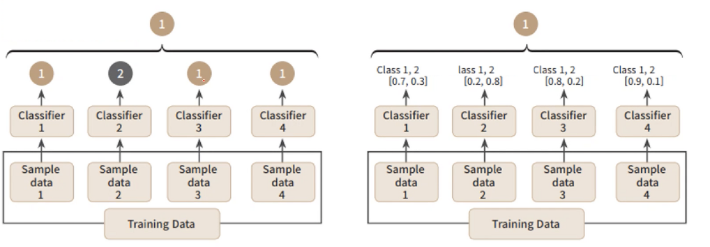
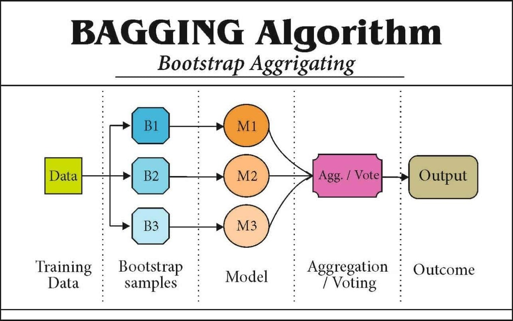
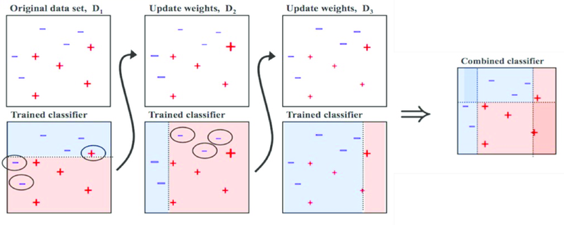

기존의 단일 모델은 늘 bias-variance trade off의 문제를 벗어나지 못했다.

모델의 정확도를 올리고자 복잡한 모델을 만들면 과대적합의 우려가 생기고 이를 해결하려 모델을 단순하게 만들면 결국은 또 과소적합의 문제가 생기는 해결하기 어려운 문제점에 봉착한다.

이 말을 **\*bias**와 **\*variance**의 관점에서 다시 말하자면 모델을 과대적합하면 variance가 커지고 bias가 작아지며 모델을 과소적합하면 variance가 작아지고 bias가 커진다. (이게 왜 문제가 되는지는 bias-variance를 주제로 포스팅을 해보려고 한다.)

우리는 이러한 트레이드오프 문제에서 모델이 가장 좋은 정확도를 가질 수 있는 분산과 편향을 찾고 싶어 한다.

따라서 이러한 문제점을 해결하고자 앙상블 방법이 제안되었다.

**\* bias(편향) :** 훈련된 예측 모델의 출력 값과 실제 모델의 출력 값의 편차를 말함. 즉, 예측값과 실제값이 얼마나 차이가 나느냐를 뜻함.
**\* variance(분산) :** 훈련된 예측 모델의 출력 값의 분산을 말함. 즉, 예측 모델의 값들이 얼마나 흩어져 있는지를 뜻함.

## ***앙상블(Ensemble)이란?***

- 여러 개의 예측모형을 만들어 조합해 하나의 최종 모형을 만드는 방법.
- 머신러닝에서 앙상블은 단어 뜻 그대로 여러 단순한 모델을 결합하여 보다 정확도가 높은 모델을 만드는 하나의 방법이다.
- 따라서 단일 분류기보다 신뢰성이 높은 예측값 도출이 가능하다.

****✓** 그렇다면 앙상블에는 어떠한 유형들이 있을까?**

**✓ 또한 상황에 따라 어떤 유형을 선택하여 사용하는 것이 좋을까?**

**이제 우리는 이 두 질문에 맞는 답을 찾아보도록 하자.**

---

##

## ***앙상블 유형***

가장 대표적인 앙상블의 유형은 **1. Voting, 2. Bagging, 3. Boosting**이 있다.

이외에도 Stacking기법이 있지만 이 글에는 앞선 3개의 유형에 대해서만 설명하도록 하겠다.

먼저 간단하게 각 알고리즘 별 차이를 요약한 표를 한번 보자.

|  |  |  |
| --- | --- | --- |
| **앙상블 유형** | **Voting** | **Bagging** |
| **공통점** | 여러개의 분류기가 투표를 통해 최종 예측 결과를 결정 | |
| **차이점** | 서로 다른 알고리즘의 분류기를 결합 | 같은 알고리즘의 분류기를 결함 |

|  |  |  |
| --- | --- | --- |
| **앙상블 유형** | **Bagging** | **Boosting** |
| **공통점** | 전체 데이터 집합으로부터 복원 랜덤 샘플링(**\*Bootstrap**)으로 훈련 데이터 집합 생성 | |
| **차이점** | 병렬학습 | 순차학습 |
| **특징** | 균일한 확률분포에 의해 훈련 데이터 집합 생성 | 분류하기 어려운 훈련 데이터 집합 생성 |

**\* Bootstrap :** 특정 분포나 표본으로부터 관측값을 생성하는 방법 중 하나인 데이터 복원 추출 샘플링 기법.

즉 주어진 D개의 데이터 자료에서 중복을 허용하여 무작위로 n개의 데이터를 여러 번 추출하는 기법이다.(D > n)

D개의 데이터를 한 번에 사용해 모델링을 진행하면 과적합의 우려가 있어 이를 동일한 크기의 표본으로 여러 개 생성하여 과적합의 위험을 줄일 수 있도록 하는 샘플링 기법이다.

---

## ***1. Voting***

위의 표에서 보았듯이 보팅은 서로 다른 알고리즘의 분류기를 결합한 것이다.

따라서 동일한 데이터 세트를 **여러 알고리즘(Regression, KNN, Decision Tree, SVM 등)으로 모델링**하여 각각의 알고리즘 결과에 대해 투표를 하여 최종 결과를 예측하는 방법이다.

그럼 각 알고리즘의 결과를 어떻게 투표하여 결과를 예측하는가?

투표 방식에는 **Hard Voting / Soft Voting** 두 가지가 있다.

voting 방법 : 왼쪽 - hard voting / 오른쪽 - soft voting

- **Hard Voting(하드 보팅) : 다수결 결정**
  - 아주 단순한 방법이다. 각 분류기의 결괏값 중 가장 많은 값을 따른다.
  - ex) 4개의 분류기 중 3개의 분류기가 1로 예측을 하였고 남은 1개의 분류기가 2로 예측하였다면 최종 결과를 1로 예측한다. (사진 속 왼쪽 그림 참조)
- **Soft Voting(소프트 보팅) : 확률 평균 결정**
  - 각 분류기의 확률을 평균 내어 최종 확률로 사용하여 분류한다.
  - ex) 1 분류기 [0.7,0.3], 2 분류기 [0.2,0.8], 3 분류기 [0.8,0.2], 4 분류기 [0.9,0.1]의 확률이 나왔다고 가정했을 때 각 분류기의 확률을 평균하면 최종적으로 [0.65,0.35]의 확률을 가진다. 이때 더 높은 값을 가지는 0.65의 확률을 선택하여 최종 결과를 1로 예측한다. (사진 속 오른쪽 그림 참조)

일반적으로 Soft Voting의 성능이 더 좋다고 알려져 있어 자주 사용한다.

---

## ***2. Bagging***

보팅과는 다르게 배깅은 **같은 알고리즘의 분류기를 결합하여 사용**하는 기법이다.

Bagging은 Bootstrap Aggregating의 준말로 bootstrap 된 샘플링 데이터들로 여러 분류기를 생성하고 결과를 aggregating(결합)시키는 방법이라는 뜻이다.

배깅은 분류기를 생성하는 방법의 차이만 있지 보팅과 같다.

D개의 데이터 세트에서 n개의 데이터 표본을 무작위 추출하여 동일한 알고리즘의 k개의 분류기를 만들었다고 가정해보자.

이 k개의 분류기를 앞서 설명한 보팅 방법으로 최종 결과를 예측하는 것이다.

bagging 방법

위의 그림을 보면 앞서 설명한 내용이 순차적으로 잘 그려져 있다.

**1) Training Data** : D개의 데이터 세트에서

**2) Bootstrap samples** : n개의 데이터 표본을 무작위로 추출하여

**3) Model** : k개의 분류기를 생성하고

**4) Aggregation/Voting** : 보팅 방법으로 각 분류기의 예측 결과를 결합하여

**5) Output :** 최종 결과를 출력한다.

사용되는 알고리즘이 정해진 것은 없지만 동일한 알고리즘을 사용해야 하며 대부분 Decision Tree(결정 트리) 알고리즘에 기반한다.

그 이유는 바로 아래에 설명하도록 하겠다.

**배깅 기법을 활용한 대표적인 모델은 Random Forest(랜덤 포레스트)가** 있다.

#### ***✓ 편향과 분산의 관점에서 보는 bagging***

배깅의 아이디어는 분산이 적은 모델을 얻기 위해 여러 개의 독립적인 모델의 예측값을 평균화하는 것이다.

배깅은 데이터를 리샘플링하여 각 샘플에서 훈련된 독립적인 k개의 모델 예측 결과의 평균을 취하기 때문에 분산이 기존 단일 모델의 1/k이 되도록 한다.

즉, 여러 개의 분류기를 사용하여 평균을 취해 최종 예측값을 도출함으로써 편향은 유지하고 분산을 줄일 수 있는 것이다.

물론 실제 훈련 시 많은 데이터가 필요하기 때문에 훈련된 모델들이 독립적이라고 보장할 순 없다.

그래서 랜덤 포레스트 모델에서는 Feature를 랜덤으로 부분 선택을 하여 여러 모델을 생성하여 각 모델들의 상관성을 낮추어 독립성을 보장하려는 방법을 취한다.

따라서 **배깅은 과적합되는 경향이 있는 모델(높은 분산 모델)에 효과적**이다.

이러한 이유로 과적합에 취약하기로 유명한 결정 트리 기반의 알고리즘을 주로 사용하는 것이라고 볼 수 있다.

---

## ***3. Boosting***

부스팅은 부트스트랩 데이터 샘플링 기법을 사용하는 점에서 배깅과 같지만 배깅과 같이 데이터를 독립적으로 샘플링하는 것은 아니다.

또한 배깅처럼 여러 분류기를 한 번에 만들어 결합하는 병렬 학습과는 달리 부스팅은 순차 학습을 진행한다.

부스팅은 잘못 분류된 객체들에 집중하여 새로운 분류 규칙을 생성하는 단계를 반복하는 알고리즘이다.

**부스팅은 여러 개의 분류기가 순차적으로 학습을 수행하되, 앞에서 학습한 분류기가 예측이 틀린 데이터에 대해서는 올바르게 예측할 수 있도록 다음 분류기에게는 가중치(weight)를 부여하면서 학습과 예측을 진행**하는 것이다.

계속해서 분류기에게 가중치를 부스팅 하면서 학습을 진행하기에 부스팅 방식으로 불린다.

boosting 방법 : 순서대로 M1 / M2 / M3 / output

boosting process를 잘 설명할 수 있는 이미지를 찾는 게 어려웠다. 주로 순차 학습 방식에만 집중된 이미지가 많아서 아쉬웠지만 위의 그림을 토대로 프로세스를 한번 설명해보도록 하겠다.

1. 랜덤 데이터 샘플 D1으로 learner M1 생성하여 성능을 판단한다.

2. 다음 신규로 생성된 랜덤 데이터 샘플 D2에 M1에서 오분류된 데이터를 포함하여 learner M2를 생성한다.

3. 이때 M1에서 오분류된 데이터에 가중치를 주어 M2를 학습하기 때문에 M2는 오분류 데이터에 집중하여 학습을 진행하게 된다.

4. 같은 방식으로 learner M3를 생성한다.

5. 모든 분류기가 생성되었으면 각 분류기의 성능에 따라 분류기의 가중치도 생성된다. 성능이 좋을수록 더 큰 가중치가 부여된다.

6. 각 분류기의 예측값에 각 가중치를 곱하여 가중평균을 낸 최종 예측값을 출력한다.

#### ***✓ 편향과 분산의 관점에서 보는 boosting***

분산을 줄이는 것을 목표로 하는 배깅과 달리 부스팅은 편향을 줄이는 데에 초점이 맞춰져 있다.

부스팅은 아이디어 그대로 모델이 잘 예측하지 못하는 데이터를 맞추는데 집중하는 방법이므로 trainset에 대한 예측 성능이 뛰어날 수는 있지만 과적합에 취약하다는 단점이 있다.

따라서 부스팅이 고려되는 모델은 편향이 큰 모델이다.

깊은 트리 기반의 모델보다는 얕은 트리 기반 모델에 적합하다.

부스팅을 기반으로 하는 알고리즘은 여러 가지가 있는데 오차에 가중치를 부여하는 방식이나 학습 속도 개선 방법에 따라 약간의 차이가 있다.

초기의 부스팅 기법인 AdaBoost와 Gradient Boost는 데이터 가중치를 계산하는 방식에서의 차이가 있는데

각 분류기의 loss function을 계산하여 residual을 최소화하는 최적화 방법을 사용하는 Gradient Boost기반이 더 널리 사용되고 있다.

하지만 이 알고리즘의 가장 큰 단점은 속도가 느리고 과적합이 심하다.

Gradient Boost 개념은 취하면서 이러한 단점들을 개선시킨 XGBoost, LightGBM 알고리즘이 나왔으며 부스팅의 대표 알고리즘으로 사용되고 있다.

---

여기까지 앙상블에 관련한 basic 한 설명을 적어보았다.

적으면서 bias-variance를 더 자세하게 수식적으로 풀어낸 글이나 각 유형별 대표 알고리즘으로 사용되고 있는 RF, XGB 등을 좀 더 자세하게 적어보고 싶다는 생각이 들었다.

꼭! 틈틈이 글을 적어서 올릴 수 있길 바라며.. ^^

**여러 자료나 책을 찾아보고 작성을 해봤는데 잘못된 정보나 내용, 그 외 지적할 만한 부분이 있다면 꼭 댓글을 남겨줬으면 좋겠다.**



**[사이트]**

- [[머신러닝 강좌 #14] 앙상블 학습(Ensemble Learning)과 보팅(Voting)](https://nicola-ml.tistory.com/95)
- [앙상블기법 배깅(bagging)과 부스팅(boosting)](https://sosoeasy.tistory.com/390)
- [편향과 분산 관점에서 배깅(Bagging)과 부스팅(Boosting)의 비교](https://bongholee.com/-ed-8e-b8-ed-96-a5-ea-b3-bc--eb-b6-84-ec-82-b0--ea-b4-80-ec-a0-90-ec-97-90-ec-84-9c--eb-b0-b0-ea-b9-85bagging-ea-b3-bc--eb-b6-80-ec-8a-a4-ed-8c-85boos/)
- [Ensemble: bagging, boosting..](https://brunch.co.kr/@chris-song/98)
- [[머신러닝] Boosting Algorithm](https://hyunlee103.tistory.com/25)

**[서적]**

- 데이터 분석 전문가 가이드 | 한국데이터산업진흥원


