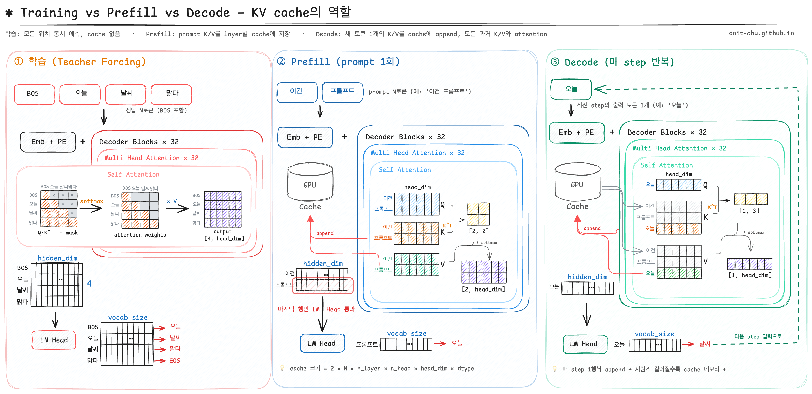
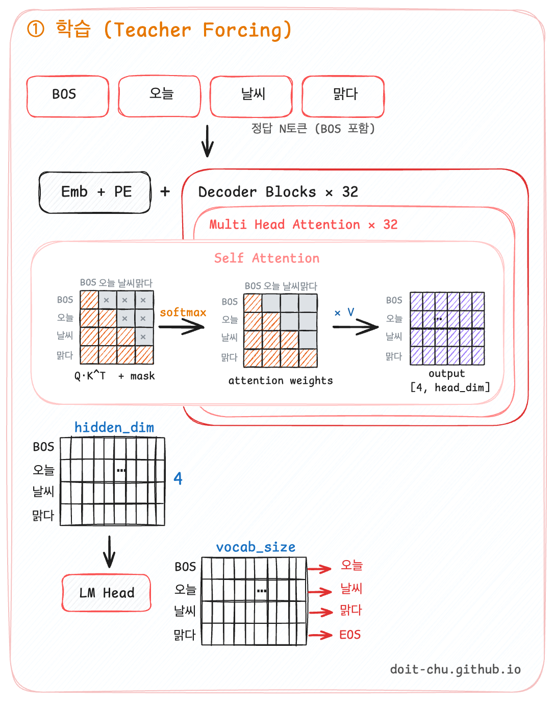
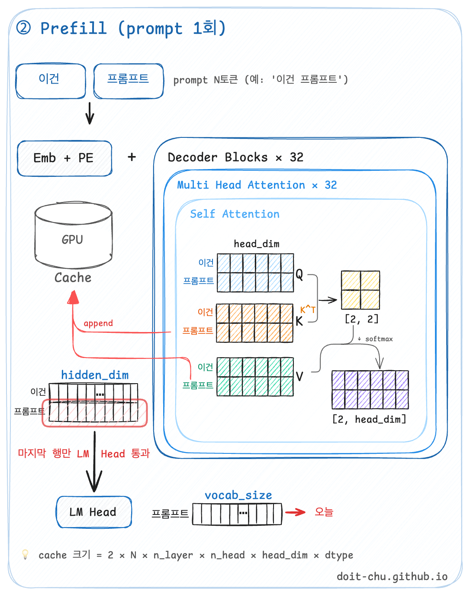
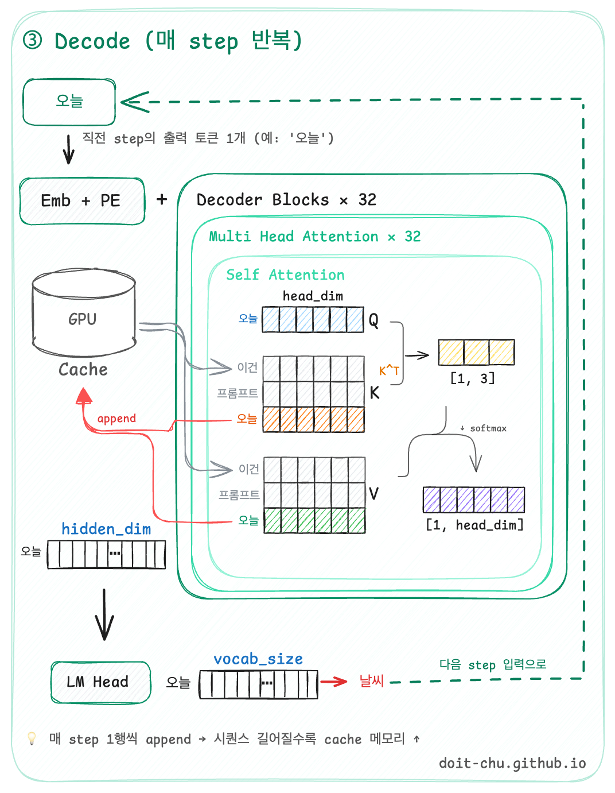
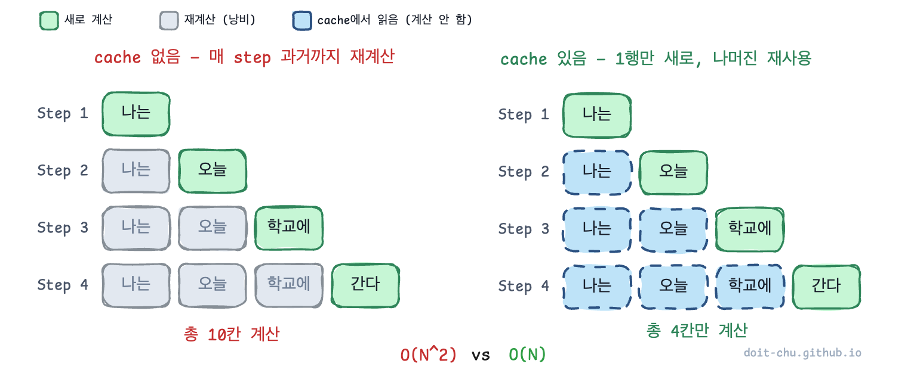
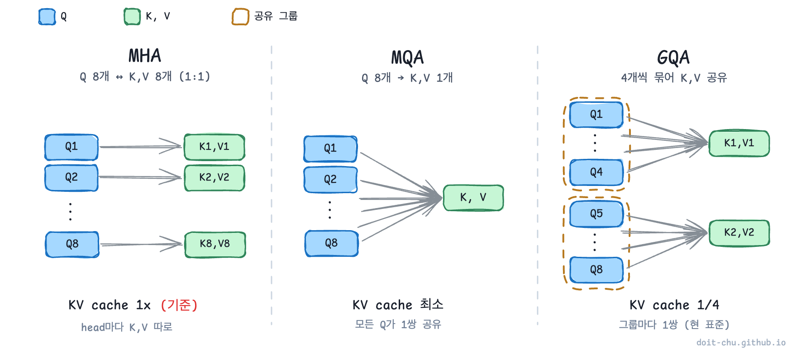
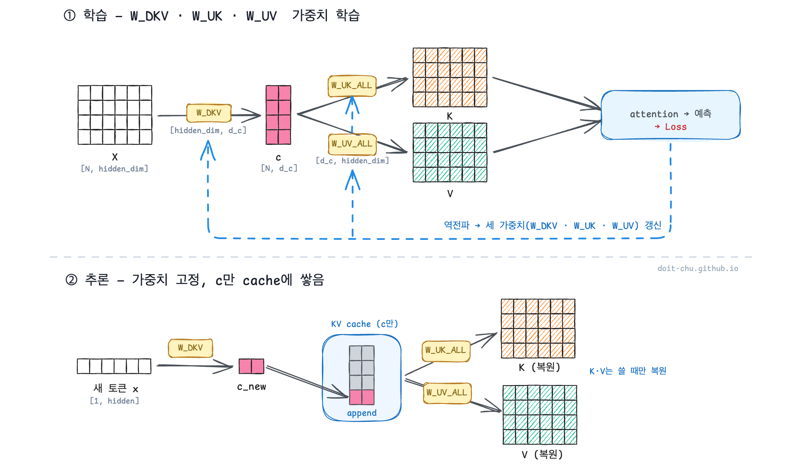
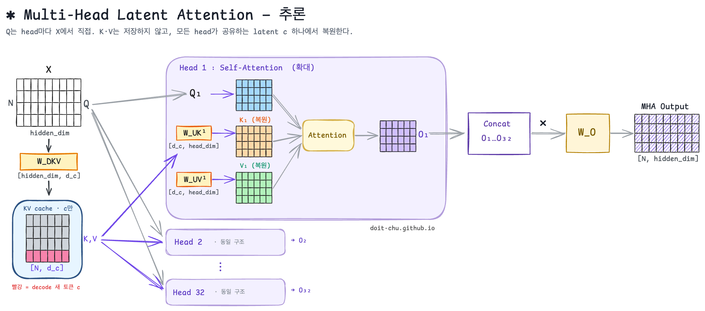

[지난 글](../decoder-only-causal-mask/)에서 GPT가 같은 모델·같은 가중치를 쓰면서도 **학습 / Pre-fill / Decode** 세 모드로 갈린다는 얘기를 했다.  
그리고 마지막에 **Decode 단계의 비효율**을 슬쩍 흘려두고 끝냈는데, 이번 글이 그 후속이다.

이번 글에서 풀 두 가지:

1. Decode가 왜 낭비인지 다시 짚고 → **KV cache** 가 어떻게 그걸 막는지
2. 근데 cache가 커지면 또 다른 문제가 생긴다 → **GQA, MLA** 가 그 cache를 어떻게 줄이는지

이걸 이해하기 전에 지난글에 작성한 <mark>train 프로세스</mark> 부터 <mark>Multi Head Attention</mark>, <mark>Self Attention</mark>를 완벽히 숙지해야한다. 

---

## 학습 / Prefill / Decode — 같은 모델, 다른 모드

세 모드를 비교해서 이해해 볼 수 있도록 구조를 그려봤다.  
각각 하나씩 살펴보도록 하자. 

### ① 학습 (Teacher Forcing)

학습에서는 정답 문장 N토큰을 **한 번에** 입력한다.   
Self-Attention 안에서 Q·Kᵀ가 (N, N) 정사각 행렬로 한 방에 계산되고, causal mask로 미래 위치만 가린다.  
그리고 각 토큰은 다음 토큰을 예측하도록 학습을 수행한다.  

forward 한 번이면 끝. cache가 필요 없다.

### ② Prefill (prompt 1회)

처음 추론 시에는 **기본 프롬프트** (예: Claude의 CLAUDE.md, ChatGPT의 system message)와 **사용자 질문**이 결합되어 모델에 input으로 들어간다. 

이 결합된 N토큰을 한 번에 입력해 학습과 동일하게 (N, N) attention을 돌린다.  
이때 학습 모드와 다른 점은 두 가지가 있다.

1.  **각 layer(SA)의 K, V를 GPU cache 슬롯에 저장** — 다음 단계(Decode)에서 재사용
2. 모든 디코더 블럭을 지나고 **마지막 행만 LM Head에 넣어 다음 토큰 1개를 예측** — 학습은 모든 행에서 다음 토큰을 예측해 loss 계산

forward도 한 번이고, 다음 단계(Decode)가 쓸 K, V를 미리 채워두는 단계.

### ③ Decode (매 step 반복)

이 단계에서는 직전 토큰을 받아 **새 토큰 1개씩** 생성한다.  
종료 조건 하나가 만족될 때까지 반복되며 일반적으로 모델이 EOS(End-of-Sequence) 토큰을 내뱉으면 자연 종료 된다.  
그 외에도 max_tokens 도달이나 stop sequence가 일치하는 경우가 있지만 이건 따로 살펴보면 좋을 것 같다.  

이 step의 핵심을 살펴보자.

- 입력은 직전 step의 출력 토큰 1개
- $Q$ 는 새로 계산 (입력 토큰에 대해서만, 1행)
- 과거 K,V는 저장되어 있기 때문에, $K_\text{new}, V_\text{new}$ 도 1행만 새로 계산해 **cache에 append**
- attention score는 학습/Prefill의 (N, N) 정사각형이 아니라 (1, N+1) 한 줄
  - 마지막 토큰이 자기 + 과거 전부를 한 번 보는
  한 줄
- 출력 1행 → 다음 layer로 → LM Head → 다음 토큰 샘플링 → 반복

**과거 $K, V$ 를 cache에서 그대로 꺼내 쓰니까 다시 계산할 필요가 없다.**

--- 

### 왜 K·V만 cache를 할까?

이미 앞선 내용에서 설명이 되지만 한번 더 짚고 넘어가보겠다.  
같은 self-attention인데 Q와 K, V의 운명이 갈리는 건, <mark>**각 행렬이 무엇을 위해 존재하는지가 다르기 때문**</mark>이다.

- **$Q$** : Q의 각 토큰은 **다음 토큰 1개를 예측하는 데**만 쓰인다. Q_i 가 토큰 i+1 예측에 쓰이고 나면 그 역할은 끝나기 때문에 다음 step에서 다시 찾을 일이 없다.
- **$K, V$** : 반면 K, V는 **모든 미래 토큰이 자기를 참조**한다. 토큰 i의 K, V는 토큰 i+1, i+2, ... 가 attention할 때마다 반복적으로 필요하다. 게다가 $K = X \cdot W_K$ 에서 $X$ 도 $W_K$ 도 안 변하니, 매번 다시 만드는 건 같은 곱셈을 반복하는 셈.

그래서 **K, V만 저장하고, Q는 매번 새로 만들고 버린다.** 

### 그럼 얼마나 아껴지나

"나는 오늘 학교에 간다"를 4 step까지 굴리면서 K, V 행 계산 횟수만 세보면 이렇게 된다.

cache가 없으면 매 step마다 과거 행을 통째로 다시 계산해 **총 10칸**(회색 6칸이 낭비), cache가 있으면 매 step 1행만 새로 계산해 **총 4칸**이다.  
낭비되던 6칸이 그대로 사라진다.  
N토큰 생성 시 cache 없는 버전은 $O(N^2)$, cache 있는 버전은 $O(N)$로 연산량이 줄어든다.

### cache는 어떻게 저장되는지?

모델 가중치 ($W_Q, W_K, W_V$ 등)는 학습으로 정해진 뒤 GPU 메모리에 그대로 박혀 있다.  
반면 KV cache는 **이번 추론 세션에서만 살아 있는 데이터**다.  
사용자가 새 대화를 시작하면 새 cache가 생기고, 대화가 끝나면 버려진다. 


**한 줄 요약**: $K, V$ 를 한 번 만들어서 저장해두고, decode 매 step마다 cache에 1행씩 append + 전체 cache로 attention.


---

## 좋아진 만큼, 메모리가 부담스러워졌다

연산 낭비는 사라졌지만 대신 **메모리에 cache를 쥐고 있어야** 한다.  
이게 얼마나 부담인지부터 계산해보겠다.

토큰 1개당 KV cache 크기는:


$$
\text{KV cache} = 2 \times \text{num_layers} \times \text{num_heads} \times \text{head_dim} \times \text{bytes}
$$


Llama 2 7B 기준으로 숫자를 박아보면:

| 항목 | 값 | 설명 |
|---|---|---|
| K, V | 2 | K,V 두개씩 저장 |
| num_layers | 32 | Decoder Block 수 |
| num_heads | 32 | Self Attention 수 |
| head_dim | 128 | num_heads × head_dim = hidden_dim |
| bytes | 2 | Float16 |

- **토큰 1개당** : 2 × 32 × 32 × 128 × 2 = **512 KB**
    - 2K 컨텍스트 : 512 KB × 2,048 ≈ **1 GB**
    - 32K 컨텍스트 : 512 KB × 32,768 ≈ **16 GB**

사용자 1명만 받아도 GPU가 빠듯하고, 여러 명을 동시에 서빙하려면 cache가 곧 GPU 슬롯 수의 상한이 된다.

여기서 cache의 크기를 줄이기 위해 <mark>**GQA는 num_heads**</mark> 를, <mark>**MLA는 head_dim**</mark> 을 줄인다.  
같은 공식의 서로 다른 변수를 건드리는 셈이다.

---

## GQA — head를 그룹 단위로 묶어 공유

먼저 <mark>**GQA(Grouped Query Attention, 2023)는 Q(Query)를 그룹 단위로 묶어, 한 그룹 안의 Q들이 같은 K/V를 공유**</mark> 한다.

지난 글에서 multi-head attention을 다룰 때, 32개 head가 각자 자기만의 $W_Q, W_K, W_V$ 를 가진다고 했다.  
곰곰이 생각해보면 Q head 수와 K/V head 수가 꼭 같아야 할 이유는 없다.  
Q는 *"무엇을 묻는가"*, K·V는 *"어떤 정보를 갖고 있는가"* 로 역할이 다르다.  
질문(Q)은 다양할수록 좋지만, 참조되는 정보(K·V)는 여러 질문이 같은 걸 공유해도 큰 손실이 없다.  
그래서 K·V head만 줄일 여지가 생긴다.

이걸 처음 밀고 나간 게 **MQA(Multi-Query Attention)**, 그리고 그걸 좀 완화한 버전이 GQA다.

| 기법 | Q head | K/V head | KV cache | 성능 |
|---|---|---|---|---|
| MHA (기존) | 32 | 32 | 1× (기준) | 기준 |
| MQA | 32 | 1 | 1/32 | 미세 손실 |
| GQA | 32 | 8 (group 4) | 1/4 | MHA에 근접 |

MQA는 너무 공격적이라 성능이 살짝 떨어진다.  
그래서 그 사이를 타협한 게 GQA — Q는 그대로 32개 두되, K/V는 **8개로 줄여서 4개씩 묶인 Q 그룹이 K/V 1쌍을 공유** 한다.

그림으로 보면 아래와 같다. 

실제 모델에선 보통 `Q head 32 / KV head 8` (그룹 4) 같은 구성으로 쓴다. 

장점은 단순하다.

- **KV cache 1/4** — K, V를 head 32개치가 아니라 8개치만 저장
- **성능 손실 거의 없음** — 그룹 안에서 Q가 다양하니 표현력이 살아 있음
- **연산 자체는 거의 동일** — attention 수식이 안 바뀜, head만 묶는 것

**그룹 수는 하이퍼파라미터** 이다.  
모델 설계 시 자유롭게 정하고, `num_heads`가 `num_kv_heads`로 나누어 떨어지기만 하면 된다.  
예시에선 num_heads가 32기 때문에 num_kv_heads를 8로 정의하여 4개의 Q를 묶도록 했다. 

- group ↑ → cache ↓, 성능 손실 ↑ (trade-off)
- 실무적으로 `num_kv_heads = 8` 근처가 sweet spot으로 자리잡음
- Llama 2 70B, Llama 3 (8B/70B), Mistral 7B, Mixtral, Falcon 40B 모두 GQA 사용

검증되고 단순해서, **현 시점 LLM의 KV cache 절감 표준은 사실상 GQA** 다.

---

## MLA — 차원 자체를 압축한다

다음은 MLA(Multi-head Latent Attention, DeepSeek-V2, 2024). GQA와 같은 목표지만 접근이 다르다.

|  | 압축 대상 | head 매칭 |
|---|---|---|
| **GQA** | head **수** | Q : K/V = N : M (그룹) |
| **MLA** | K/V **벡터 차원** | MHA처럼 1:1 |

GQA가 "head 수"를 건드렸다면, MLA는 head 수는 그대로 두고 **K, V 벡터 자체를 저차원으로 압축**한다.

발상은 이렇다. 입력 $X$ 에서 $K, V$ 를 만들 때 보통은 두 개의 큰 가중치 $W_K, W_V$ 로 직접 만든다. MLA는 그 사이에 **저차원 latent 벡터 $c$** 를 끼워 넣는다.  
여기서 헷갈리기 쉬운데, **MLA에는 단일 $W_K, W_V$ 가 아예 없다.** 그 하나의 큰 가중치를 **두 조각으로 쪼갠** 것이다.

$$
K = c \cdot W_{UK} = (X \cdot W_{DKV}) \cdot W_{UK} = X \cdot \underbrace{(W_{DKV} \cdot W_{UK})}_{\text{옛날 } W_K}
$$

즉 기존 $W_K$ ( `hidden × hidden` 큰 행렬) 를 $W_{DKV}$ ( `hidden × d_c` ) 와 $W_{UK}$ ( `d_c × hidden` ) 의 곱으로 **저랭크 분해**한 것이다. (LoRA와 같은 발상)

이게 학습과 추론에서 어떻게 돌아가는지 보면 이렇다.


- **학습** : $W_{DKV}, W_{UK}, W_{UV}$ **세 가중치를 학습**한다 ($W_K, W_V$ 를 쪼갠 것). 전체 토큰을 한 번에 forward하고 cache는 안 쓴다.
- **추론** : 학습된 가중치는 **고정**. 새 토큰을 $c$ 로 압축해 **cache엔 $c$ 만 append**, $K, V$ 가 필요할 때 $W_{UK}, W_{UV}$ 로 **복원**한다.


다시 정리해보자.

| | MHA | MLA |
|---|---|---|
| 학습되는 가중치 | $W_K, W_V$ | $W_{DKV}, W_{UK}, W_{UV}$ (분해형) |
| cache에 저장 | $K, V$ (둘 다 넓음) | $c$ (좁음) 하나 |
| 추론 시 $K, V$ | cache에서 바로 | $c$ 에서 복원 |

- **K, V는 직접 저장 안 함**, 압축된 latent $c$ **하나만** 저장
- $c$ 하나로 $K, V$ 둘 다 만들어내니까 추가 절감이 따라옴
- attention 계산할 때 $c$ → $K, V$ 로 매번 복원해서 씀

### c는 모든 head가 공유한다 — 이게 진짜 절감 포인트

위 그림을 보면 뭔가 이상하지 않은가?  
아니라면 다행이지만.. 난 이부분이 헷갈려서 MHA 관점의 구조를 다시 그려봤다.  
기존 kv cache 과정을 보면 모든 self-attention에서 cache를 진행하기 때문에 차원이 [N, head_dim]으로 나와야하는데 위의 이미지는 [N, hidden_dim]이다.

위 그림의 행렬은 **head 전체를 합친(MHSA) 관점**이라 $K$ 가 `[N, hidden_dim]` 으로 그려져 있던 것이다.  
여기서 MLA의 핵심은 — **압축된 $c$ 는 head마다 따로가 아니라 모든 head가 하나를 공유**한다는 점이다. 

즉, 다시 말하자면 $W_{DKV}$는 모든 head가 공유하는 하나의 가중치이며 $W_{UK}, W_{UV}$ 이 가중치들은 사실 각각의 head에서 $W_{UK}^1, W_{UV}^1$, ... , $W_{UK}^{32}, W_{UV}^{32}$로 학습된다. 

 

GQA는 head **수**를 줄여서 절감하지만, MLA는 아예 **head 수와 무관한 공유 $c$ 하나로** 묶어버린다. 이게 MLA가 GQA보다 더 깊게 줄이는 이유다.

**Trade-off는 명확하다.**

- (+) cache 메모리 ↓↓ (GQA보다 더)
- (−) 매 step마다 $c$ → $K, V$ **복원 연산** 추가
- (−) RoPE(위치 인코딩, 이후 글에서 다룰 예정)와 결합 시 트릭 필요 (decoupled RoPE)

DeepSeek가 V2/V3에서 이걸로 **671B 모델을 합리적인 메모리로 서빙**한 게 임팩트였고, 이후 MLA가 새로운 표준 후보로 떠올랐다. 다만 RoPE 결합 등 구현 난이도가 있어서, 보수적인 곳에선 여전히 GQA가 기본값이다.


**GQA와 MLA는 별개 라인이다.** 한 모델이 둘을 동시에 쓰진 않는다. 둘 다 KV cache 메모리를 줄이는 게 목적이지, 서로 보완 관계가 아니다.


---

## 정리

| 기법 | 줄이는 것 | 어떻게 | 채택 모델 |
|---|---|---|---|
| **KV cache** | Decode 연산 | $K, V$ 를 저장해두고 재사용 | 모든 LLM |
| **MHA** | — | head마다 K, V 따로 (기준) | — |
| MQA | KV cache | Q 32개가 K,V 1쌍 공유 (공격적) | — |
| **GQA** | KV cache | Q 그룹별로 K,V 1쌍 공유 (**현 표준**) | Llama 2/3, Mistral, Qwen |
| **MLA** | KV cache | K,V 안 저장, latent $c$ 만 저장 | DeepSeek V2/V3 |

- Decode의 핵심 낭비는 **$K, V$ 재계산** → KV cache가 막아줌
- 대신 cache 자체가 메모리를 먹는다. 32K 컨텍스트에서 7B 모델 cache가 16GB
- 그 cache를 줄이는 두 갈래가 **GQA (head 수 공유) / MLA (벡터 차원 압축)**

이걸로 "Decode가 한 토큰을 뱉어내는 한 사이클" 자체는 어지간히 정리됐다. 다음 차례는 **계산 시간**을 줄이는 쪽이다. cache는 메모리, 그럼 연산은? GPU의 메모리 계층까지 신경 써서 같은 attention 수식을 더 빠르게 돌리는 **FlashAttention** 이 다음 글 주제다.

 



- [GQA: Training Generalized Multi-Query Transformer Models (Ainslie et al., 2023)](https://arxiv.org/abs/2305.13245)
- [DeepSeek-V2: A Strong, Economical, and Efficient Mixture-of-Experts Language Model (2024)](https://arxiv.org/abs/2405.04434)
- [Fast Transformer Decoding: One Write-Head is All You Need (MQA, Shazeer 2019)](https://arxiv.org/abs/1911.02150)


