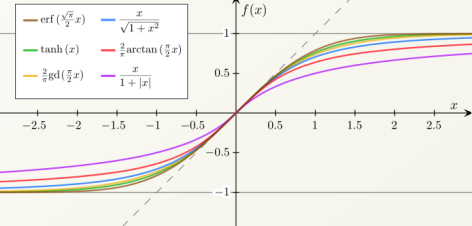

해당 포스트는 로지스틱 함수를 구하는 방법을 적어보려고 한다.

로지스틱 회귀분석에 대한 방법이 적혀있는 글은 아니다.

단지 기존의 회귀 식이 어떻게 로지스틱 회귀식으로 변형이 되는지 수식과 함께 천천히 풀어보려고 한다.

---

## ***Sigmoid Function 특징***

- Bounded : 0과 1 사이의 유한한 구간을 가짐
- Differentiable : 미분 가능
- Real Function : 실제 함수
- Defined for all real inputs : 모든 Input에 정의
- With positive derivative : 단조 증가

Many types of Sigmoid functions&amp;amp;amp;amp;amp;amp;nbsp;

시그모이드 함수는 S자형 곡선을 갖는 수학 함수이며 로지스틱, 탄젠트 함수 등을 포함한다.

모든 점에서 음이 아닌 미분 값을 가지며 단 하나의 변곡점을 포함한다.

로지스틱 함수는 위와 같은 시그모이드 함수의 특징을 가지면서 쉽게 미분이 가능하여 최적화하기 좋다.

---

##

## ***Logistic Function***

Logistic Regression은 binomial 또는 multinomial classification이 모두 가능하다.

하지만 이 글에서는 binomial classification만 다루도록 하겠다.

베르누이 실험에서 관측값 x가 주어졌을 때 y가 나올 확률은

$P(y|x) = \mu(x)^y(1-\mu(x))^{1-y}$ 이다. ([참조](https://eatchu.tistory.com/17))

- y=1이면, $P(y=1|x) = \mu(x)$
- y=0이면, $P(y=0|x) = 1-\mu(x)$

그럼 이제 우리가 알고 있는 이 확률 값을 가지고 Logistic Function을 구해보자.

우리가 구하고자 하는 **Logistic Function은 음의 무한대부터 양의 무한대까지의 실수값을 0과 1 사이의 실수 값으로 대응시키는 시그모이드 함수**이다.

다시 말하자면 수많은 그리고 복잡한 변수의 값(모든 실수)들을 받아서 0과 1 사이의 확률 값을 뱉어내는 수식을 유도하는 것이다.

하지만 기존의 회귀식은 $y\,=\,w_i\,+\,w^Tx_i$ 로 우변($w_i\,+\,w^Tx_i$)과 좌변($y$)의 계산값이 맞지 않다.

따라서 우리는 **logit변환을 통해 좌변($y$)의 범위를 맞출 것**이다.

logit변환이란 Log + Odds를 뜻하는데 앞서 말한 y가 0 또는 1일 확률 값을 가지고 오즈비로 변환하여 로그를 취해주는 것이다.

먼저 오즈비를 만들어보자.


Odds Ratio = $\dfrac{\mu(x)}{(1-\mu(x))}$


- $\mu(x)\;:\;[0 - 1]$
- $\dfrac{\mu(x)}{(1-\mu(x))} \; : \; [0 - \infty]$

$\mu(x)$는 확률 값이기 때문에 0-1 사이의 실수 값을 가지며 오즈비는 양의 무한대 범위를 갖는다.

하지만 아직 음의 무한대 범위를 갖지 못한다.

따라서 오즈비에 log를 취해준다.


log(Odds Ratio) = $log\dfrac{\mu(x)}{(1-\mu(x))}$


로짓 변환의 결과는 x에 대한 선형 함수와 동일하므로 이제 좌변과 우변의 계산 값이 맞는 식이 만들어진다.


log(Odds Ratio) = $log\dfrac{\mu(x)}{(1-\mu(x))}$ = $w_i\,+\,w^Tx_i$


좌변과 우변의 계산 값이 맞춰줬으니 이제 최종적으로 찾고자 하는 값을 찾아야 한다.

이제 이 식에서 우리가 찾고 싶은 값은 $\mu(x)$이다. ($\mu(x)\,=\,P(y=1|x)$)

$\mu(x)$를 찾으면 binomial classification을 수행할 수 있게 된다.

편의상 $f(x) = w_i\,+\,w^Tx_i$ 로 치환하여 수식을 진행하겠다.


$log\dfrac{\mu(x)}{(1-\mu(x))}$ = $f(x)$

$\dfrac{\mu(x)}{(1-\mu(x))}$ = $e^{f(x)}$

$\mu(x)$ = $(1-\mu(x))e^{f(x)}$

$\mu(x)$ = $e^{f(x)}\,-\,\mu(x)e^{f(x)}$

$\mu(x)\,+\,\mu(x)e^{f(x)}$ = $e^{f(x)}$

$\mu(x)(1+e^{f(x)})$ = $e^{f(x)}$

$\mu(x)$ = $\dfrac{e^{f(x)}}{(1+e^{f(x)})}$


이제 좌변에 $e^{f(x)}$를 나누어주면 우리가 잘 알고 있는 Logistic Function을 구할 수 있게 된다.


$logistic\;Function\,=\,\dfrac{e^{f(x)}}{1+e^{f(x)}}$

$\qquad\qquad\qquad\;=\,\dfrac{1}{1+\frac{1}{e^{f(x)}}}$

$\qquad\qquad\qquad\;=\,\dfrac{1}{1+e^{-f(x)}}$


---

---

---

다음 글은 logistic regression parameter 최적화 과정을 수식으로 적어보고 싶다.



- [Logistic Regression Part.1](https://gentlej90.tistory.com/69)
- [6.1 로지스틱 회귀분석 — 데이터 사이언스 스쿨](https://datascienceschool.net/03%20machine%20learning/10.01%20%EB%A1%9C%EC%A7%80%EC%8A%A4%ED%8B%B1%20%ED%9A%8C%EA%B7%80%EB%B6%84%EC%84%9D.html)
- [로지스틱 회귀 - 위키백과, 우리 모두의 백과사전](https://ko.wikipedia.org/wiki/%EB%A1%9C%EC%A7%80%EC%8A%A4%ED%8B%B1_%ED%9A%8C%EA%B7%80)
- [[LECTURE] 4.1. Decision Boundary : edwith](https://www.edwith.org/machinelearning1_17/lecture/10590?isDesc=false)


