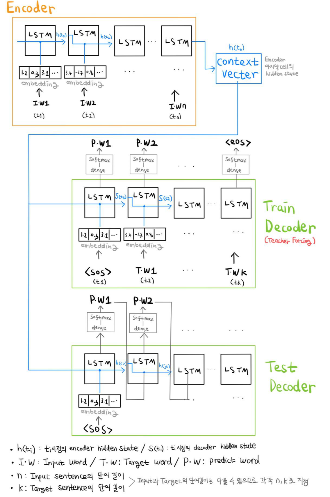
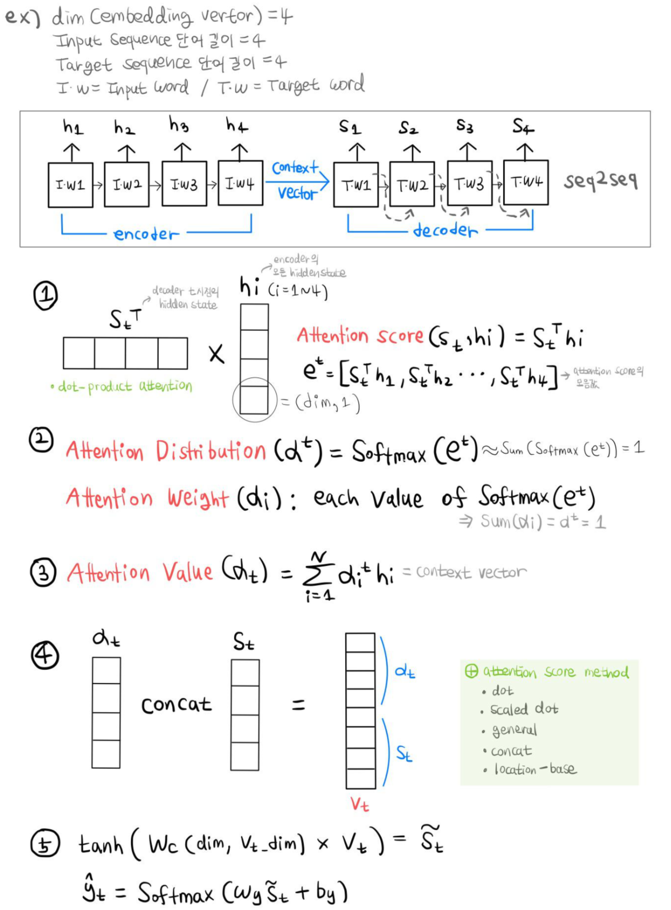
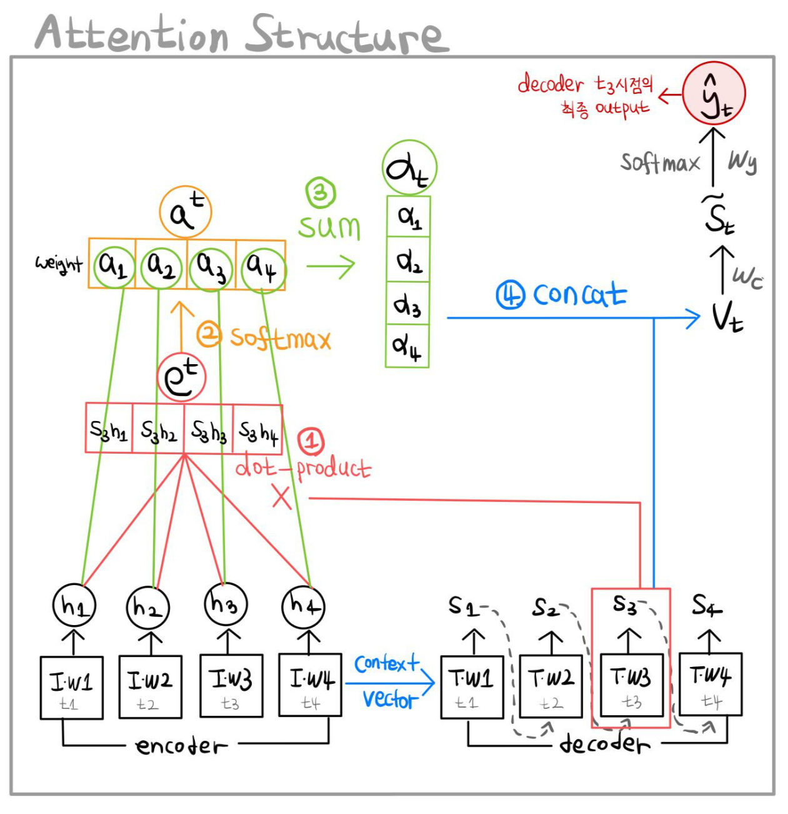
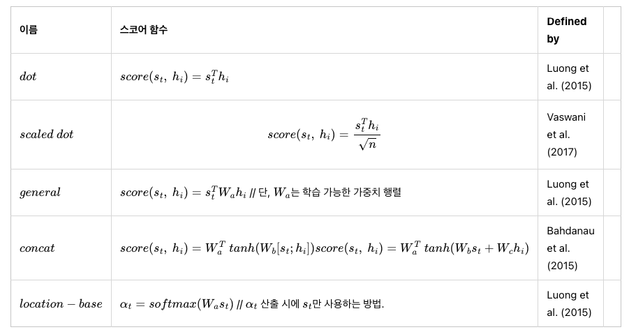
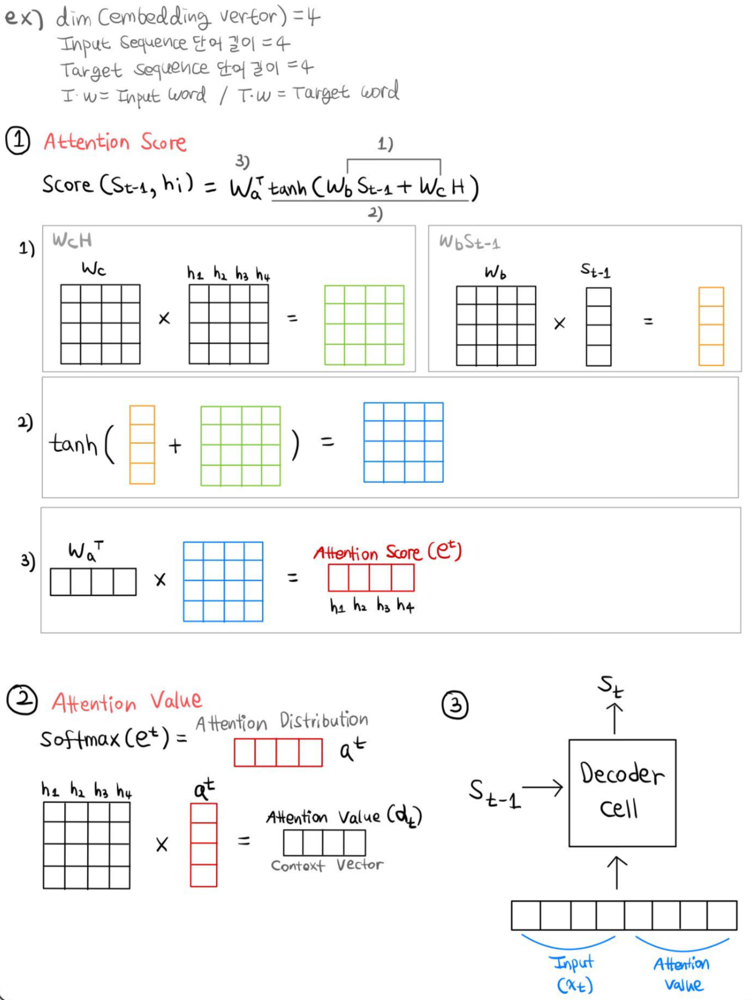
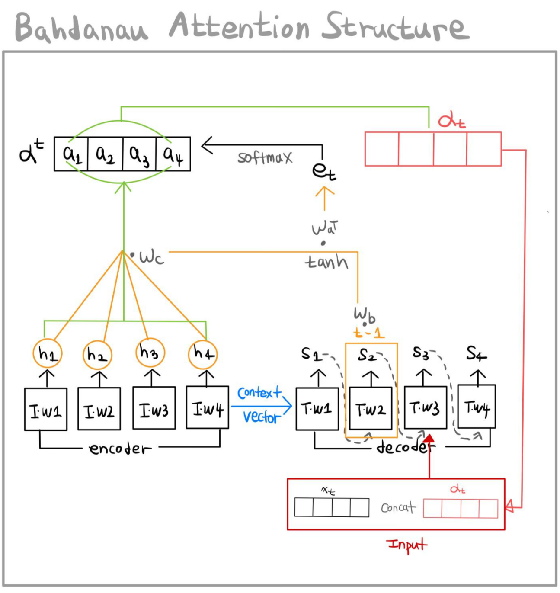

## **Seq2Seq, sequence to sequence**

seq2seq는 두 개의 RNN을 encoder와 decoder구조로 연결하여 사용하는 모델이다.

이러한 encoder-decoder 구조는 입력 문장과 출력 문장의 길이가 다를 경우 사용한다.

- 번역(Translation)
- 텍스트 요약(Text Summarization)
- 음성 인식(SST, Speech to Text)

Seq2Seq Structure

Seq2Seq의 구조를 요약하여 그려보았다.

처음 접한다면 이 구조만 보고 이해하기 어려울 것이다.

[Seq2Seq 프로세스](https://wikidocs.net/24996)를 숙지하여 본다면 요약본으로 보기 좋을 것 같다.

Input word(Iw) / Target word(Tw) / Predict word(Pw)는 내가 이해하기 쉽게 명칭을 적어놓았다..

---

## **Attention Model**

Attention은 기존 Seq2Seq의 문제점을 해결하고자 등장하였다.

기존의 Seq2Seq 모델의 단점은

1. 하나의 context vector에 Input 정보를 모두 압축하기 때문에 정보 손실의 우려가 있음
2. RNN의 고질적인 문제인 Vanishing Gradient 발생

이 있다.

따라서 Attention의 기본 Idea는 decoder 예측의 매 시점마다 encoder 전체 입력 문장을 재 참조하는 것이다.

하지만 모두 동일한 비율이 아닌 해당 시점에 연관있는 입력 단어에 집중(attention)한다.

Attention Process

Attention Structure

[Attention 프로세스](https://wikidocs.net/22893)를 숙지하여 그림을 보는 것을 추천한다.

이해가 쉽게 embedding vector의 차원과 Input, Target의 단어 길이는 모두 동일하게 4로 설정하여 프로세스를 그려봤다.

다양한 Attention Score Method는 아래 표를 참조.

Attention에서는 dot을 사용했다.

Attention Score Method

---

## **Bahdanau Attention**

기존의 Attention과 Bahdanau Attention의 차이점은 이렇다.

|  |  |
| --- | --- |
| Attention | Bahdanau Attention |
| t시점의 decoder hidden state 사용 | t-1시점의 decoder hidden state 사용 |
| 구해진 attention value가 t시점의 output에 반영됨 | 구해진 attention value가 t시점의 input에 반영됨 |
| attention score 계산 시 dot method 사용 | attention score 계산 시 concat method 사용 |

Bahdanau Attention Process

Bahdanau Attention Structure

[Bahdanau Attention 프로세스](https://wikidocs.net/73161) 참고

위의 Attention과 마찬가지로 embedding vector의 차원과 Input, Target의 단어 길이는 모두 동일하게 4로 설정하였다.

모든 과정은 NLP입문자들의 바이블인 <https://wikidocs.net/book/2155> 이 사이트를 보며 작성한 것이다.

설명 진짜 미쳤음.

내가 올린 자료들은 개인적인 노트정리라 허점이 많긴하겠지만.. ^^

[NLP1\_eatchu.pdf

5.83MB](./file/NLP1_eatchu.pdf)
