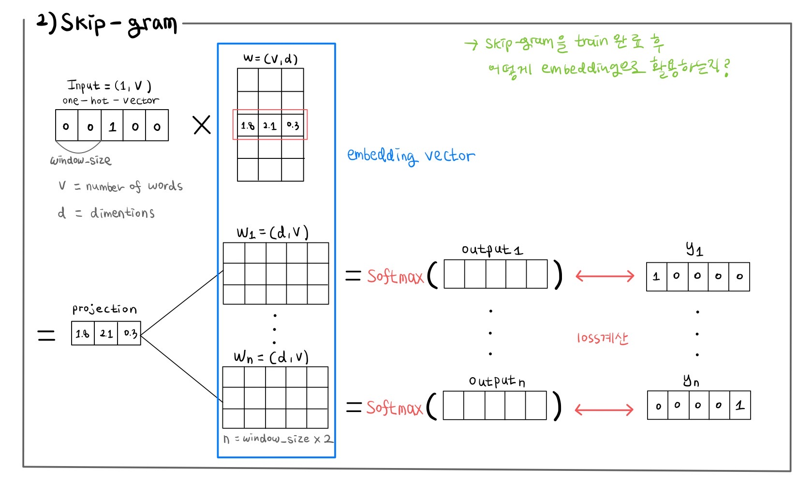
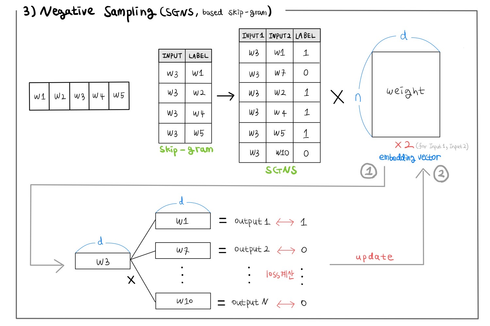

Word2Vec의 학습방식을 공부하고 남기는 노트 자료입니다.

상세한 설명은 [[WikiDocs]딥 러닝을 이용한 자연어 처리 입문](https://wikidocs.net/22660)에서 보면 좋을 것 같습니다.

먼저 CBOW(Continuous Bag of Words)의 구조는 넣지 않았습니다.

Skip-gram을 이해하면 쉽게 이해할 수 있는 구조입니다.

skip-gram

SGNS

**학습방식을 사전에 충분히 숙지한 뒤 나중에 참고용으로 보면 좋을 것** 같습니다.(는 내 얘기)
