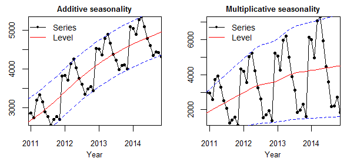

## ***Prophet*** : Trend, Seasonality, Holiday

***y(t)=g(t)+s(t)+h(t)+ϵi***

- g(t) : piecewise linear or logistic growth curve for modelling non-periodic changes in time series
  시계열의 비 주기적 변화를 모델링하기 위한 부분적 선형 또는 로지스틱 곡선
- s(t) : periodic changes (e.g. weekly/yearly seasonality)
  주기적 변화
- h(t) : effects of holidays (user provided) with irregular schedules
  일정이 불규칙한 휴가들
- ϵi : error term accounts for any unusual changes not accommodated by the model
  모델에서 수용하지 않는 비정상적인 변화들

위에서 **Trend** 를 구성하는***g(t)***함수는 주기적이지 않은 변화인 트렌드를 나타낸다. 부분적으로 선형 또는 **logistic** 곡선으로 이루어져 있다. 그리고 **Seasonality** 인 ***s(t)***함수는 **weekly, yearly** 등 주기적으로 나타나는 패턴들을 포함한다. **Holiday**를 나타내는***h(t)*** 함수는 휴일과 같이 불규칙한 이벤트들을 나타냅니다. 만약 특정 기간에 값이 비정상적으로 증가 또는, 감소했다면, holiday로 정의하여 모델에 반영할 수 있다. 마지막으로**\_ ϵi \_**는 정규분포라고 가정한 **오차**이다.

### ***hyperparameter***

1. Trend

ParameterDescription

|  |  |
| --- | --- |
| changepoints | 트렌드 변화시점을 명시한 리스트값 이미 변화시점을 알고있다면 파라미터를 추가해 더 정확한 결과를 얻을 수 있다. |
| changepoint\_prior\_scale (default = 0.05) | changepoint(trend) 의 유연성 조절 값이 커질수록 트렌드를 유연하게 감지하지만 과적합 위험이 있다. |
| n\_changepoints | changepoint 의 개수 |
| changepoint\_range | changepoint 설정 가능 범위. (기본적으로 데이터 중 80% 범위 내에서 changepoint를 설정합니다.) |

2. Seasonality

ParameterDescription

|  |  |
| --- | --- |
| yearly\_seasonality | 연 계절성  default = 10 : 값이 커질수록 유연해지고 과적합 위험 |
| weekly\_seasonality | 주 계절성  default = 10 |
| daily\_seasonality | 일 계절성 |
| seasonality\_prior\_scale | 계절성 반영 강도 |
| seasonality\_mode | ‘additive ‘ 인지 ‘multiplicative’ 인지 |

- 파라미터에 없는 monthly seasonality 추가하기

m.add\_seasonality(name='monthly', period=30.5, fourier\_order=5)

- Additive Seasonality : Time series = Trend + Seasonality + Error
- Multiplicative Seasonality : Time series = Trend \* Seasonality \* Error

3. holiday

ParameterDescription

|  |  |
| --- | --- |
| holidays | 휴일 또는 이벤트 기간을 명시한 데이터프레임 |
| holiday\_prior\_scale | holiday 반영 강도 |

- m.add\_country\_holidays(country\_name=’국가코드’)로 간단하게 국가 공휴일을 불러올 수도 있다. 하지만 모든 국가의 공휴일이 있는건 아님
