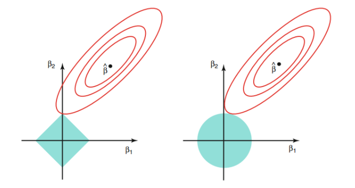
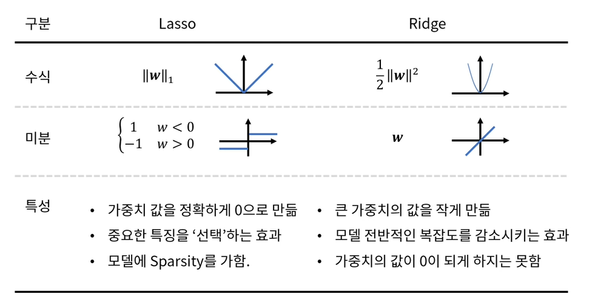

##

## **Regularization 정규화**

선형 회귀에서 우리는 Error를 줄이기 위해 SSE(Sum of Square Error)를 minimize 했다.


$minimize SSE = \Sigma_{i=1}^{n}(y_i - \hat{y_i})^2 = \Sigma_{i=1}^{n}(y_i - w_0 -w_1x_i)^2$


이러한 최적화 방법으로 우리는 주어진 데이터를 가장 잘 fitting 할 수 있는 모델을 학습하게 된다.

이후 새로 들어온 데이터가 우리가 가정한 추세선과는 멀리 떨어져 있다면 새로운 데이터에 대해 error가 매우 커질 것이다.

이런 문제는 우리가 만든 모델이 새로운 데이터를 잘 예측하지 못하는 variance Error(Large Coefficient)라고 할 수 있다.

즉, 주어진 데이터의 Error를 줄이는 데에만 집중하다 보니 회귀 계수 값이 너무 커지게 되면서 과적합이 발생한 것이다.

(계수 값이 커질수록 주어진 데이터에 최적화된다.)

그렇다면 앞으로 올 새로운 데이터를 대비하여 모델을 단순하게 만들면 되지 않을까?라는 생각을 할 수도 있지만

단순한 모델을 만들면 결국 또 bias error가 커지게 된다.

그래서 **복잡한 모델을 만들되 전체적인 데이터셋의 trend를 따르도록 하자는 목적으로 나온 게 이 정규화**이다.

즉, **기존의 최적화 방법은 적용하되 데이터의 민감도는 줄이고자 하는 것**이다.

그래서 정규화는 기존의 loss function에 새로운 term을 하나 추가한다.

**L1-Regularization(Lasso)** : loss function에 **회귀계수 절댓값의 합**을 추가


$Cost = argmin_w(RSS(w) + \lambda||w||_1)$


**L2-Regularization(Ridge)** : loss function에 **회귀계수 제곱 합**을 추가


$Cost = argmin_w(RSS(w)+\lambda||w||_2^2)$


이제 왼쪽 항의 $RSS(w)$를 minimize 하고자 계수 값이 커지게 된다면 오른쪽 항의 계수 term으로 인해 제어가 된다.

그냥 무작정 error를 잡자고 계수 값을 올려버릴 수 없게 된다.

여기서 **$\lambda$는 tuning parameter로 값이 커질수록 회귀계수 값이 0에 가까이 수렴(L2)하거나 회귀계수가 아예 0이 되게(L1) 한다.**

$\lambda$가 0이라면 기존의 최적화 방법을 사용하는 것과 같다.

여기서 $\lambda$가 커짐에 따라 L1과 L2의 목적이 약간 달라지는데

L1의 경우 회귀계수 자체를 줄이는 것이 목적이며 L2는 모델의 복잡도를 줄이는 것이 목적이다.

---

## **Lasso(L1),  Ridge(L2) 그래프**

왼쪽 : L1 / 오른쪽 : L2


$Cost = Loss + Regularization$


그림에서 왼쪽 그래프는 L1을 나타낸 것이고 오른쪽은 L2를 나타낸 것이다.

각 그래프의 빨간색 등고선은 비용 함수의 Loss를 나타낸 것이고 파란 마름모와 원은 각 정규화 별 계수 제약조건($L1=|w|, \; L2=w^2$)을 나타낸 것이다.

이때 각 $\hat{\beta}\,(=\hat{w})$의 검은색 포인트가 loss term에서의 회귀계수 최적 값이지만 우리는 Loss term과 Regularization term을 같이 최적화하여 값을 찾고자 하기 때문에 두 그래프가 맞닿는 빨간 선의 $\beta\,(=w)$값을 최종적으로 선택하게 된다.

**L1은 절댓값이 들어간 수식으로 마름모 형태를 보이고 있어 모서리의 뾰족한 부분이 맞닿게 된다.**

**따라서 L1은 일부 회귀계수가 0으로 완전히 수렴하게 되는 것이다.**

**반대로 L2는 제곱을 사용하면서 원 모양을 보이고 있어 둥근 모서리를 갖고 있기 때문에 계수가 0에 가깝게 작을 수는 있지만 완전히 0으로 수렴하지는 않는다.**

---

## **Lasso(L1) vs Ridge(L2)**

그럼 이 L1와 L2 중에 어떤 방법을 사용하는 게 더 좋을까?

L1의 특징 중 하나는 회귀계수를 완전히 0이 되게 한다는 것이다.

따라서 출력 변수에 미치는 입력 변수의 영향력 편차가 큰 경우에 이 정규화 방법을 사용할 수 있다.

변수의 수를 줄이고 간단한 데이터셋으로 모델 학습을 진행하고 싶다면 L1가 적합하다.

하지만 L1가 간단한 모델을 만들기는 좋지만 결국은 여러 변수의 영향력을 죽여 small set으로 모델을 학습하기 때문에 정확도가 떨어질 수 있는 것이 단점이다.

따라서 일반적으로는 L2를 사용하는 것이 학습 시 더 좋은 결과를 만들고 대부분 학습시 L2를 사용한다.

---

## **Summarize**

Lasso와 Ridge에 대해 간단하게 잘 요약된 표가 있어서 가져와봤다.

앞서 설명한 내용들이 잘 요약되어 있는 것 같다.



**[강의]**

- edwith : [인공지능 및 기계학습 개론 CH06](https://www.edwith.org/machinelearning1_17/lecture/10863?isDesc=false)
- fastcampus : 딥러닝/인공지능 올인원 패키지 Online
- fastcampus : 머신러닝과 데이터분석 A-Z 올인원 패키지 Online

**[블로그]**

- [Lasso 간단한 설명과 ridge, lasso 비교](https://modern-manual.tistory.com/22)
- [L1, L2 Regularization](https://gaussian37.github.io/dl-concept-regularization/)


